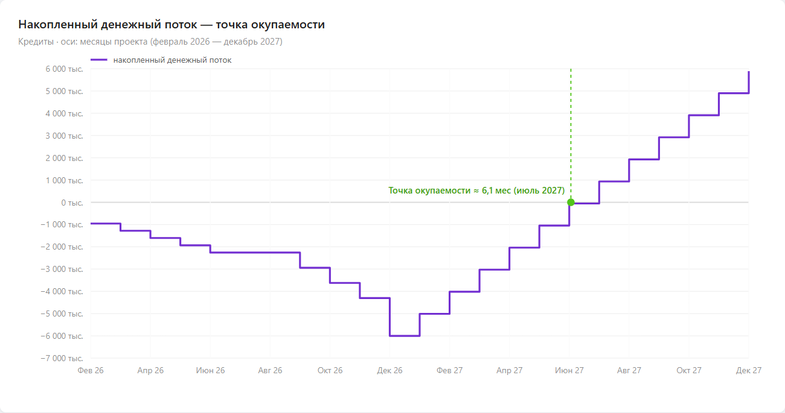

# Business Case

## Бизнес-обоснование

---

# 1. Introduction (Введение)

Данный документ представляет собой бизнес-обоснование разработки системы управления элитной клиникой переноса сознания. Документ содержит описание целей проекта, бизнес-контекста, финансовой эффективности, ограничений и ожидаемых результатов внедрения системы, а также за какой срок инвестиции могут окупиться.

## 1.1 Purpose (Назначение)

Целью данного документа является обоснование необходимости программного обеспечения «SCMS — Sleeving Clinic Management System». До внедрения системы большинство операций выполняется вручную: учёт клонированных тел в таблицах, бронирование по телефону, протоколы переноса на бумаге, формирование сертификатов вручную, отсутствие единого журнала действий. После внедрения — автоматизация процессов подбора и бронирования sleeves, мониторинга needlecast, постпроцедурной валидации и генерации сертификатов совместимости. В расчётах рассматривается бизнес-модель контрактной разработки для конкретной клиники.

Документ используется для:

- Оценки целесообразности проекта.
- Определения ожидаемой выгоды.
- Анализа затрат и рисков.
- Согласования проекта между заказчиком и разработчиками.

## 1.2 Scope (Область применения)

Документ относится к проекту разработки корпоративной информационной системы для элитной клиники переноса сознания в Бей-Сити (2384 год).

Система предназначена для:

- Элитных клиентов (Meths), заказывающих новые тела.
- Специалистов по подбору тел (Sleeve Broker).
- Техников, выполняющих перенос сознания (Needlecaster).
- Врачей, проводящих валидацию после переноса (Psychosurgeon).
- Администрации клиники.

Система будет использоваться для:

- Управления каталогом клонированных тел и их бронирования.
- Фиксации результатов процедуры needlecast.
- Фиксации результатов постпроцедурного наблюдения.
- Автоматической генерации сертификатов совместимости.
- Предоставления защищённого личного кабинета клиентам (Meth).

## 1.3 Definitions, Acronyms and Abbreviations (Определения и аббревиатуры)

| Термин / Аббревиатура | Определение | Используется в документах |
|----------------------|-------------|--------------------------|
| SCMS | Sleeving Clinic Management System — разрабатываемая система. | Все документы проекта |
| Stack / Кортикальный стек | Устройство хранения сознания, имплантируемое в затылок. | Vision, SRS, Glossary |
| Sleeve | Клонированное или подобранное тело для переноса сознания. | Vision, SRS, Glossary |
| Meth | Сверхбогатый клиент клиники, владелец множества стеков. | Vision, SRS, Glossary |
| Needlecast | Процесс передачи сознания из стека в нейроны нового тела. | Vision, SRS, Glossary |
| DHF | Digital Human Freight — цифровые данные сознания. | Vision, SRS, Glossary |
| Stack Shock | Психосоматический шок после переноса сознания. | Vision, SRS, Glossary |
| FR | Functional Requirement — функциональное требование. | SRS, SAD, TestPlan |
| RBAC | Role-Based Access Control — ролевая модель доступа. | SRS, SAD |
| 2FA | Two-Factor Authentication — двухфакторная аутентификация. | SRS, Glossary |
| MTTR | Mean Time To Recovery — среднее время восстановления системы. | SRS, SDP, TestPlan |
| Audit Log | Неизменяемый журнал всех операций в системе. | SRS, SAD, Glossary |
| NDA | Non-Disclosure Agreement — соглашение о неразглашении. | Glossary |
| ROI | Return on Investment — окупаемость инвестиций. | BusinessCase |
| KPI | Key Performance Indicator — ключевой показатель эффективности. | BusinessCase |

Детальные определения всех терминов приведены в документе «Glossary (Глоссарий)» проекта SCMS.

## 1.4 References (Ссылки)

1. Vision (Концепция) проекта SCMS, версия 1.0.
2. SRS (Спецификация требований) проекта SCMS, версия 1.0.
3. SDP (План разработки) проекта SCMS, версия 1.0.
4. Risk List (Список рисков) проекта SCMS, версия 1.0.
5. Use Case Specification — проекта SCMS, версия 1.0.
6. Ричард Морган, «Видоизменённый углерод» — литературный источник концепции.

## 1.5 Overview (Обзор документа)

| Раздел | Содержание |
|--------|-----------|
| 1. Introduction | Назначение, область, определения, ссылки, обзор |
| 2. Product Description | Описание разрабатываемого программного обеспечения, задач, которые он решает |
| 3. Business Context | Описание сферы применения, рынка, текущих издержек клиники |
| 4. Product Objectives | Цели продукта, план достижения, сравнение эффективности до и после внедрения |
| 5. Financial Forecast | Финансовый прогноз, стоимость разработки, окупаемость, ROI |
| 6. Constraints | Описание ограничений, которые могут повлиять на стоимость и оценку рисков |

---

# 2. Product Description (Описание продукта)

Разрабатываемый продукт представляет собой корпоративную информационную систему «SCMS — Sleeving Clinic Management System» для автоматизации ключевых бизнес-процессов элитной клиники переноса сознания (sleeving) в Бей-Сити, 2384 год.

Использование данной системы позволяет значительно сократить операционные расходы клиники за счёт автоматизации многих процессов, которые в настоящее время выполняются вручную: учёт клонированных тел, бронирование, протоколирование переноса, формирование сертификатов. Автоматизация уменьшает объём ручной работы персонала, снижает вероятность ошибок при бронировании и подборе тел, ускоряет проведение процедур и обеспечивает прозрачность всех этапов для клиентов (Meths).

Внедрение системы особенно актуально в условиях растущей конкуренции среди клиник sleeving в Бей-Сити. Клиника получает возможность быстрее обслуживать клиентов, масштабировать количество процедур без существенного увеличения затрат персонала, а также обеспечивать юридическую защищённость через неизменяемый аудит-лог и автоматическую генерацию сертификатов с криптографической подписью.

Дополнительно продукт обеспечивает защищённый личный кабинет для клиентов (Meth), что повышает удовлетворённость клиентов и даёт конкурентное преимущество перед клиниками, где статус кейса узнаётся по телефону. Система может масштабироваться и адаптироваться под другие клиники sleeving, что расширяет потенциальный рынок.

---

# 3. Business Context (Бизнес-контекст)

Программный продукт «SCMS» применяется в сфере элитных медицинских услуг и ориентирован на клиники, предоставляющие услуги переноса сознания (sleeving) для сверхбогатых клиентов (Meths) в Бей-Сити.

## 3.1 Pain Points (Боли пользователей)

| Пользователь | Боли | Последствия |
|-------------|------|-------------|
| **Meth (Клиент)** | Невозможность самостоятельно просмотреть каталог тел и оформить заказ; отсутствие информации о статусе кейса; необходимость звонить по телефону для получения информации | Долгое ожидание ответа, невозможность планировать своё время, отсутствие контроля над процессом |
| **Sleeve Broker** | Ручной учёт тел в Excel; двойное бронирование из-за отсутствия единой базы; долгий поиск подходящего тела по параметрам | Потеря клиентов, ошибки в бронировании, неэффективное использование времени |
| **Needlecaster** | Бумажные протоколы переноса; | Задержки в фиксации результатов, риск потери данных, позднее выявление осложнений |
| **Psychosurgeon** | Ручное заполнение сертификатов; отсутствие истории осмотров в системе; невозможность автоматически сгенерировать PDF | Ошибки в документах, сложности при аудите, дополнительные трудозатраты |

## 3.2 Market (Рынок)

Потенциальными пользователями системы являются: владельцы клиники, Sleeve Broker (специалисты по подбору тел), Needlecaster (техники, выполняющие перенос), Psychosurgeon (врачи, проводящие валидацию), а также клиенты Meths, получающие доступ к личному кабинету.

Продукт ориентирован на рынок клиник sleeving Бей-Сити с численностью от 10 до 100 клиентов в год, заинтересованных в автоматизации процессов подбора тел, мониторинга переносов и управления документацией.

**Таблица текущих зарплат сотрудников клиники, участвующих в процессе sleeving**

| Должность | К-во | Заработная плата 1 сотрудника, кредитов/мес | Суммарные затраты, кредитов/мес |
|-----------|------|---------------------------------------------|-------------------------------|
| Владелец клиники (Директор) | 1 | 500 000 | 500 000 |
| Sleeve Broker | 2 | 200 000 | 400 000 |
| Needlecaster | 3 | 250 000 | 750 000 |
| Psychosurgeon | 2 | 300 000 | 600 000 |
| Администратор | 1 | 150 000 | 150 000 |
| **Итого** | **9** | | **2 400 000** |

**Таблица операционных месячных издержек (ручные процессы)**

| Статья расходов | Описание | Обоснование | Затраты, кредитов/мес |
|----------------|----------|-------------|----------------------|
| Ведение каталога тел в Excel | Ручной учёт параметров sleeves в таблицах | 2 брокера × 20 часов/мес × 500 кредитов/час | 20 000 |
| Бронирование по телефону | Согласование заказов с клиентами по телефону | 10 часов/мес × 1 000 кредитов/час | 10 000 |
| Бумажные протоколы needlecast | Фиксация этапов переноса на бумаге | 3 needlecaster × 15 часов/мес × 800 кредитов/час | 36 000 |
| Ручная генерация сертификатов | Оформление PDF-сертификатов вручную | 2 psychosurgeon × 10 часов/мес × 1 000 кредитов/час | 20 000 |
| Печать и канцелярия | Бланки, журналы, сертификаты на бумаге | Расходные материалы | 8 000 |
| Телефонные уведомления клиентов | Информирование Meth о статусе кейса | 15 часов/мес × 1 000 кредитов/час | 15 000 |
| Ручной аудит-журнал | Ведение журнала действий для Протектората | Администратор, 10 часов/мес × 500 кредитов/час | 5 000 |
| **Итого операционных** | | | **114 000** |

**Таблица дополнительных издержек, связанных с ручной обработкой и внештатными ситуациями**

| Статья расходов | Обоснование | Затраты, кредитов/мес |
|----------------|-------------|----------------------|
| Двойное бронирование (потерянные клиенты) | Ручной учёт приводит к конфликтам бронирования, потеря 1 клиента/мес × 500 000 кредитов среднего чека | 500 000 |
| Задержки подбора тела | Поиск свободного тела занимает до 3 дней вместо 30 минут, простой персонала | 80 000 |
| Ошибки в сертификатах | Переделка сертификатов из-за ошибок ввода, юридические риски | 50 000 |
| Штрафы Протектората за нарушение протоколов | Неполные аудит-логи, отсутствие цифровых подписей | 100 000 |
| Потеря репутации и отток клиентов | 2–3 Meth в год уходят к конкурентам из-за долгого обслуживания | 150 000 |
| Простой needlecast из-за отсутствия мониторинга | Осложнения, выявленные поздно, увеличивают время процедуры | 70 000 |
| **Итого дополнительных** | | **950 000** |

**Совокупные издержки ручного управления процессами sleeving:**

| Тип издержек | Сумма, кредитов/мес |
|-------------|---------------------|
| Операционные издержки (ручные процессы) | 114 000 |
| Дополнительные издержки (ошибки, штрафы, потери) | 950 000 |
| **Итого** | **1 064 000** |

---

# 4. Product Objectives (Цели продукта)

## 4.1 Product Goals (Цели продукта)

| Цель | Описание | KPI | Целевое значение |
|------|----------|-----|------------------|
| Автоматизация каталога sleeves | Замена ручного учёта в Excel на цифровой каталог с фильтрами | Время подбора тела | ≤30 мин вместо 3 дней |
| Автоматизация бронирования | Устранение двойного бронирования через единую базу | Количество конфликтов бронирования | 0 в месяц |
| Мониторинг needlecast | Отслеживание статуса переноса в реальном времени | Задержка обновления данных | ≤100 мс |
| Автоматическая генерация сертификатов | Замена ручного заполнения на авто-генерацию PDF | Время генерации сертификата | ≤5 сек |
| Личный кабинет Meth | Защищённый портал для клиентов | Доступность портала | 95% времени |

## 4.2 Expected Benefits (Ожидаемые выгоды)

Разработка направлена на:
- Снижение ежемесячных расходов на 991 000 кредитов (93.1% от текущих).
- Уменьшение количества ручных операций на 90%.
- Повышение прозрачности процессов для клиентов (личный кабинет 24/7).
- Обеспечение юридической защищённости через неизменяемый аудит-лог.
- Сокращение времени обслуживания клиента с 3 дней до 30 минут.

Для достижения поставленных целей планируется реализация двух порталов: внешнего (личный кабинет Meth) и внутреннего (интерфейсы персонала). Разработка будет выполняться поэтапно в соответствии с SDP: проектирование архитектуры, реализация базового функционала, тестирование и внедрение.

Предварительная оценка рисков включает возможность изменения требований со стороны клиники, сложности интеграции с внешними генетическими архивами, обеспечения безопасности данных клиентов.

**Таблица сравнения ежемесячных расходов до и после внедрения системы**

| Статья расходов | До внедрения, кредитов/мес | После внедрения, кредитов/мес | Изменение |
|----------------|---------------------------|------------------------------|-----------|
| Ведение каталога тел в Excel | 20 000 | 0 | −20 000 |
| Бронирование по телефону | 10 000 | 0 | −10 000 |
| Бумажные протоколы needlecast | 36 000 | 0 | −36 000 |
| Ручная генерация сертификатов | 20 000 | 0 | −20 000 |
| Печать и канцелярия | 8 000 | 1 000 | −7 000 |
| Телефонные уведомления клиентов | 15 000 | 0 | −15 000 |
| Ручной аудит-журнал | 5 000 | 0 | −5 000 |
| Двойное бронирование (потери) | 500 000 | 0 | −500 000 |
| Задержки подбора тела | 80 000 | 5 000 | −75 000 |
| Ошибки в сертификатах | 50 000 | 2 000 | −48 000 |
| Штрафы Протектората | 100 000 | 10 000 | −90 000 |
| Потеря репутации | 150 000 | 20 000 | −130 000 |
| Простой needlecast | 70 000 | 10 000 | −60 000 |
| Лицензия SCMS | 0 | 25 000 | +25 000 |
| Поддержка и хостинг | 0 | включено в лицензию | — |
| **Итого** | **1 064 000** | **73 000** | **−991 000** |

**Таблица изменений эффективности бизнес-процессов**

| Процесс | До внедрения | После внедрения |
|---------|-------------|-----------------|
| Подбор sleeve | 1–3 дня | 30 минут |
| Бронирование тела | Телефонный звонок + запись в Excel | 2 минуты в каталоге |
| Фиксация этапов needlecast | Бумажный журнал | Цифровой протокол с таймерами |
| Генерация сертификата | 1–2 часа вручную | 5 секунд автоматически |
| Поиск информации о клиенте | Ручной поиск по таблицам | Мгновенно через поиск |
| Проверка совместимости стека | Визуальная сверка | Автоматическая проверка |
| Уведомление клиента | Телефонный звонок | Push/email/SMS |
| Аудит для Протектората | Сбор данных вручную | Экспорт из аудит-лога |

**Ключевые показатели успеха (KPI):**

| Показатель | Значение |
|-----------|----------|
| Время подбора sleeve | ≤30 минут |
| Время генерации сертификата | ≤5 секунд |
| Создание учётной записи сотрудника | ≤2 минуты |
| Uptime системы | 95% |
| Количество инцидентов с потерей данных | 0 |
| Время отклика интерфейса | ≤0.5 сек |

---

# 5. Financial Forecast (Финансовый прогноз)

Все расчёты приведены в кредитах — валюте Бей-Сити (2384 год). 1 кредит ≈ 1 рубль.

**График окупаемости**

*Накопленный денежный поток по месяцам проекта (февраль 2026 — декабрь 2027). Затраты на разработку приходят ступенями по фазам, экономия начинается после ввода в эксплуатацию (январь 2027). Кривая пересекает ноль в точке окупаемости — ≈ 6,1 месяца после запуска (июль 2027).*

**Сводная таблица (Статья — Стоимость — Доход — Примечания)**

| Статья | Стоимость, кредитов | Доход, кредитов/мес | Примечания |
|--------|---------------------|---------------------|------------|
| Разработка | 5 680 000 | — | 1 600 чел.-ч по фазам (SDP §4.2.4); включает тестирование (QA Engineer 200 ч) |
| Внедрение | включено в разработку | — | Transition 696 000: развёртывание, приёмочное тестирование, обучение |
| Поддержка | 25 000/мес | — | Лицензия и сопровождение системы |
| Инфраструктура и риск-буфер | 320 000 | — | Сервер 20 000 (4 мес) + буфер 300 000 |
| Экономия от внедрения | — | 991 000 | Ежемесячные расходы 1 064 000 → 73 000 |
| **Итого** | **6 000 000** | **991 000/мес** | Окупаемость ≈ 6,1 мес (июль 2027) |

**Таблица стоимости разработки системы из SDP**

| Фаза | Трудозатраты, ч | Сумма, кредитов | На что расходуется |
|------|-----------------|-----------------|--------------------|
| Inception | 260 | 952 000 | Аналитика, Vision, SRS черновик, BusinessCase, SDP черновик |
| Elaboration | 350 | 1 306 000 | SAD, Use Case, TestPlan, RiskList, Glossary, финализация SRS и SDP |
| Construction | 800 | 2 726 000 | Реализация UC-01…UC-05, админ-панель, интеграция, тесты |
| Transition | 190 | 696 000 | Деплой, приёмочное тестирование, обучение, документация |
| **Оплата труда — итого** | **1 600** | **5 680 000** | 2 участника × 10 месяцев |
| Сервер и инфраструктура | — | 20 000 | Хостинг сервера (4 мес. по 5 000) |
| Риск-буфер (5 %) | — | 300 000 | Непредвиденные расходы; только с согласования PM |
| **ИТОГО ПРОЕКТ** | | **6 000 000** | |

**Таблица сравнения ежемесячных затрат**

| Показатель | Без системы, кредитов/мес | С системой, кредитов/мес |
|-----------|--------------------------|--------------------------|
| Операционные издержки ручного управления | 114 000 | 1 000 |
| Дополнительные издержки (ошибки, штрафы, потери) | 950 000 | 47 000 |
| Лицензия системы | 0 | 25 000 |
| **Общие ежемесячные расходы** | **1 064 000** | **73 000** |

**Таблица экономического эффекта в ежемесячных тратах**

| Показатель | Значение, кредитов |
|-----------|-------------------|
| Ежемесячные расходы без системы | 1 064 000 |
| Ежемесячные расходы с системой | 73 000 |
| Ежемесячная экономия | 991 000 |

**Таблица накопленного денежного потока по месяцам**

| Месяц | Событие | Накопленный денежный поток, кредитов |
|-------|---------|--------------------------------------|
| 0 (фев 2026) | Inception | −952 000 |
| 1 (мар 2026) | Elaboration | −1 278 500 |
| 2 (апр 2026) | Elaboration | −1 605 000 |
| 3 (май 2026) | Elaboration | −1 931 500 |
| 4 (июн 2026) | Elaboration завершена | −2 258 000 |
| 5 (июл 2026) | Летний перерыв | −2 258 000 |
| 6 (авг 2026) | Летний перерыв | −2 258 000 |
| 7 (сен 2026) | Construction | −2 939 500 |
| 8 (окт 2026) | Construction | −3 621 000 |
| 9 (ноя 2026) | Construction | −4 302 500 |
| 10 (дек 2026) | Transition, ввод в эксплуатацию | −6 000 000 |
| 11 (янв 2027) | Экономия | −5 009 000 |
| 12 (фев 2027) | Экономия | −4 018 000 |
| 13 (мар 2027) | Экономия | −3 027 000 |
| 14 (апр 2027) | Экономия | −2 036 000 |
| 15 (май 2027) | Экономия | −1 045 000 |
| 16 (июн 2027) | Экономия | −54 000 |
| 17 (июл 2027) | **Точка окупаемости** | **+937 000** |
| 18 (авг 2027) | Экономия | +1 928 000 |
| 19 (сен 2027) | Экономия | +2 919 000 |
| 20 (окт 2027) | Экономия | +3 910 000 |
| 21 (ноя 2027) | Экономия | +4 901 000 |
| 22 (дек 2027) | Экономия | +5 892 000 |

**Расчёт окупаемости:**

- Затраты на разработку: 6 000 000 кредитов (приходят ступенями в феврале — декабре 2026).
- Экономия: 991 000 кредитов/мес, начинается с января 2027 (после ввода в эксплуатацию).
- Срок окупаемости с момента ввода: 6 000 000 / 991 000 ≈ 6,1 месяца → **июль 2027**.
- От старта проекта: ≈ 17 месяцев.

**ROI (коэффициент возврата инвестиций) за 3 года:**

- Совокупная экономия за 36 месяцев: 991 000 × 36 = 35 676 000 кредитов.
- Общие инвестиции: 6 000 000 кредитов.
- Чистая прибыль: 35 676 000 − 6 000 000 = 29 676 000 кредитов.
- ROI: (35 676 000 − 6 000 000) / 6 000 000 × 100 % = 494,6 %.

**Вывод:** затраты на разработку (6 000 000 кредитов) приходят ступенями в течение 2026 года; система вводится в эксплуатацию в декабре 2026, экономия 991 000 кредитов/мес начинается с января 2027. Накопленный денежный поток пересекает ноль примерно через **6,1 месяца эксплуатации (июль 2027)**. За трёхлетний период совокупный экономический эффект — 35 676 000 кредитов, ROI — 494,6 %.

---

# 6. Constraints (Ограничения)

## 6.1 Юридические ограничения

Операции с DHF (Digital Human Freight) законодательно не урегулированы в полной мере. Клиника работает в серой зоне закона — система должна минимизировать юридические риски при проверках Протектората. Все операции должны фиксироваться в неизменяемом аудит-логе с цифровыми подписями сотрудников. Сертификаты совместимости должны содержать криптографическую подпись для юридической значимости.

## 6.2 Рыночные ограничения

На рынке Бей-Сити действуют 12 клиник-конкурентов, предлагающих услуги sleeving. Система должна давать измеримое преимущество в скорости обслуживания клиентов и качестве сервиса. Отсутствие автоматизации создаёт риск оттока клиентов к конкурентам с более современными системами.

## 6.3 Требования к безопасности и конфиденциальности

Meths платят 2–50 млн кредитов за процедуру и требуют абсолютной приватности. Система не может допустить утечек данных о клиентах, их медицинских записях или параметрах тел. Все данные должны шифроваться квантовым алгоритмом. Доступ к данным клиента — только для назначенного персонала и самого клиента.

## 6.4 Технические ограничения

Система должна поддерживать работу в стерильных условиях операционной — прямой доступ к клавиатуре/мышке для Needlecaster ограничен. Интерфейс должен обеспечивать крупные элементы управления, поддержку жестового или голосового управления. Процедура needlecast не должна прерываться — система должна обеспечивать 95% доступности в рабочее время.

## 6.5 Ограничения, связанные с внедрением

Для полноценного использования системы персонал клиники должен пройти обучение работе с интерфейсом. На этапе внедрения возможное временное снижение эффективности из-за адаптации к новому формату работы. Система требует стабильного электропитания и резервных источников для хранилищ стеков.

## 6.6 Зависимость от внешних поставщиков

SCMS зависит от внешних поставщиков: генетические архивы (данные о клонированных телах), охранные корпорации (системы безопасности и квантовое шифрование). Срыв поставок или повышение цен могут повлиять на операционные расходы клиники. Архитектура системы должна поддерживать интеграцию с минимум двумя поставщиками каждого типа.
