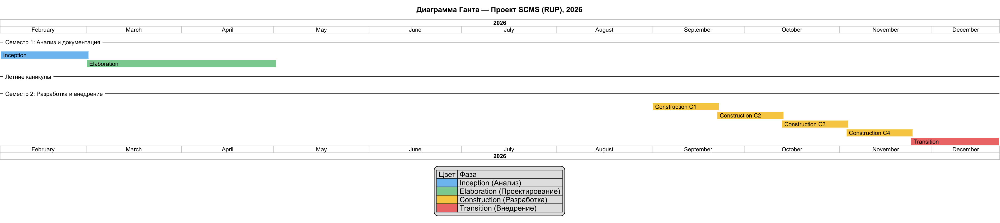

# Software Development Plan

## План разработки продукта

---

# 1. Introduction (Введение)

Документ содержит план разработки корпоративной информационной системы управления клиникой Sleeving (SCMS). Описаны организация проекта, процессы управления, расписание, бюджет и ресурсы.

## 1.1 Purpose (Назначение)

Назначение документа — определить организационную структуру, роли, процессы, расписание и бюджет для успешной реализации проекта SCMS. Документ используется проектной командой для планирования и контроля разработки.

## 1.2 Scope (Область применения)

Документ относится к проекту SCMS — разработке системы управления элитной клиникой переноса сознания в Бей-Сити. Применим ко всем фазам разработки: от анализа требований до ввода в эксплуатацию.

## 1.3 Definitions, Acronyms and Abbreviations (Определения и аббревиатуры)

| Термин / Аббревиатура | Определение | Используется в документах |
|----------------------|-------------|--------------------------|
| SCMS | Sleeving Clinic Management System — разрабатываемая система. | Все документы проекта |
| Stack / Кортикальный стек | Устройство хранения сознания, имплантируемое в затылок. | Vision, SRS, Glossary |
| Sleeve | Клонированное или подобранное тело для переноса сознания. | Vision, SRS, Glossary |
| Meth | Сверхбогатый клиент клиники, владелец множества стеков. | Vision, SRS, Glossary |
| Needlecast | Процесс передачи сознания из стека в нейроны нового тела. | Vision, SRS, Glossary |
| DHF | Digital Human Freight — цифровые данные сознания. | Vision, SRS, Glossary |
| Stack Shock | Психосоматический шок после переноса сознания. | Vision, SRS, Glossary |
| FR | Functional Requirement — функциональное требование. | SRS, SAD, TestPlan |
| RBAC | Role-Based Access Control — ролевая модель доступа. | SRS, SAD |
| 2FA | Two-Factor Authentication — двухфакторная аутентификация. | SRS, Glossary |
| MTTR | Mean Time To Recovery — среднее время восстановления системы. | SRS, SDP, TestPlan |
| Uptime | Показатель доступности системы (95% в рабочее время). | SRS, SDP, TestPlan |

Детальные определения всех терминов приведены в документе «Glossary (Глоссарий)» проекта SCMS.

## 1.4 References (Ссылки)

- Vision (Концепция) проекта SCMS, версия 1.0.
- SRS (Спецификация требований) проекта SCMS, версия 1.0.
- Glossary (Глоссарий) проекта SCMS, версия 1.0.

## 1.5 Overview (Обзор документа)

Раздел 2 содержит обзор проекта, его цели и ожидаемые результаты. Раздел 3 описывает организацию команды. Раздел 4 — процессы управления, расписание и бюджет.

---

# 2. Project Overview (Обзор продукта)

## 2.1 Project Purpose, Scope, and Objectives (Назначение, цели и контекст продукта)

Проект направлен на разработку SCMS — корпоративной системы для автоматизации процессов элитной клиники sleeving: учёт тел, резервирование, планирование процедур, мониторинг needlecast, пост-трансферная валидация и генерация сертификатов.

**Цели разработки:**
1. Обеспечить централизованный учёт всех sleeves и стеков клиники.
2. Автоматизировать процесс бронирования и культивирования тел.
3. Обеспечить мониторинг процедуры needlecast в реальном времени.
4. Реализовать постпроцедурное наблюдение с фиксацией результатов и авто-генерацией сертификатов.
5. Предоставить Meth защищённый личный кабинет для отслеживания статуса кейса.

## 2.2 Assumptions and Constraints (Влияющие факторы и ограничения)

- Состав команды: 2 разработчика, совмещающие роли по RUP/RAP: Developer 1 — Project Manager / System Analyst / QA Engineer; Developer 2 — Software Architect / Developer / DevOps Engineer.
- Технологический стек: Java (backend, Spring Boot), TypeScript (frontend, React), PostgreSQL.
- Развёртывание: сервер helios.cs.ifmo.ru (FreeBSD, OpenJDK 21, Node.js 22).
- Срок разработки: 2 учебных семестра (февраль — декабрь, ~10 месяцев).
- Бюджет: не предусмотрен (учебный проект, без финансирования).
- Документация ведётся на русском и английском языках (билингвальный формат).

## 2.3 Project Deliverables (Ожидаемые результаты проекта)

- Документация: Vision, SRS, SAD, SDP, TestPlan, RiskList, Glossary, BusinessCase.
- Исходный код: backend API (Java) + frontend (React) + инфраструктура развёртывания (Docker Compose, CI/CD).
- Набор автоматических тестов: unit, integration, e2e.
- Инсталляционный пакет для развёртывания на сервере.

## 2.4 Evolution of the Software Development Plan (План развития данного документа)

- Версия 1.0 — начальный план (текущая).
- Версия 1.1 — уточнение после фазы анализа (2 месяца).
- Версия 2.0 — финальный план после утверждения архитектуры (4 месяца).
- Изменения вносятся при: изменении требований.

---

# 3. Project Organization (Организация проекта)

## 3.1 Organizational Structure (Структура команды разработки)

| Роль (RUP/RAP) | Кто выполняет | Ответственность |
|----------------|---------------|-----------------|
| Project Manager / System Analyst | Developer 1 | Управление проектом, коммуникация с заказчиком, сбор требований, Vision, SRS, контроль сроков |
| Software Architect / Developer | Developer 2 | Проектирование архитектуры, разработка backend и frontend, SAD, выбор технологий |
| QA Engineer (Tester) | Developer 1 (совмещено) | Тестирование, TestPlan, написание авто-тестов, баг-трекинг |
| DevOps Engineer | Developer 2 (совмещено) | Развёртывание, CI/CD, администрирование сервера |

## 3.2 External Interfaces (Внешние интерфейсы)

| Интерфейс | Описание | Формат взаимодействия |
|-----------|----------|----------------------|
| Заказчик | Лоренс Банкрофт (владелец клиники) — утверждение требований и приёмка | Личные встречи, Telegram, Email |
| Преподаватель | Курс «Основы программной инженерии» — методическое руководство | Консультации, код-ревью документации |
| Преподаватель (консультант) | Экспертиза по архитектурным решениям | Консультации по SAD |
| Генетические архивы | Внешние API для заказа культивирования sleeves | REST API, JSON |
| Протекторат Бей-Сити | Регулятор — требования к аудит-логам и отчётности | PDF-отчёты, электронные подписи |

## 3.3 Roles and Responsibilities (Роли и обязанности)

| Роль (RUP/RAP) | Кто | Обязанности | Deliverables |
|----------------|-----|-------------|--------------|
| Project Manager | Developer 1 | Управление проектом, коммуникация с заказчиком, планирование итераций, контроль сроков, проведение stand-up и sprint review | Vision, SRS, SDP, отчёты для заказчика |
| System Analyst | Developer 1 | Сбор и анализ требований, документирование use case, работа с заказчиком | SRS, Use Case Specification, Glossary |
| Software Architect | Developer 2 | Проектирование архитектуры, выбор технологий, определение нефункциональных требований | SAD, Technology Stack |
| Developer | Developer 2 | Разработка backend (Java/Spring Boot) и frontend (React), code review | Исходный код, unit-тесты |
| QA Engineer | Developer 1 (совмещено) | Написание тест-кейсов, ручное и автоматизированное тестирование, оформление баг-репортов | TestPlan, тест-кейсы, баг-репорты |
| DevOps Engineer | Developer 2 (совмещено) | Развёртывание, CI/CD, администрирование сервера helios.cs.ifmo.ru | Docker Compose, CI/CD pipeline, инструкция развёртывания |

---

# 4. Management Process (Процесс управления)

## 4.1 Project Estimates (Оценка сроков разработки проекта)

- Общая длительность: 10 месяцев (февраль — декабрь, два семестра).
- Состав команды: 2 разработчика, совмещающие роли по RUP/RAP.
- Трудозатраты: ~20 человеко-месяцев.

## 4.2 Project Plan (План проекта)

### 4.2.1 Phase Plan (План фаз)

| Фаза | Итераций | Начало | Конец |
|------|----------|--------|-------|
| Семестр 1 — Inception (Анализ) | 1 | Февраль 2026 | Март 2026 |
| Семестр 1 — Elaboration (Проектирование) | 1 | Апрель 2026 | Июнь 2026 |
| Семестр 2 — Construction (Разработка) | 4 | Сентябрь 2026 | Октябрь 2026 |
| Семестр 2 — Transition (Внедрение) | 1 | Ноябрь 2026 | Декабрь 2026 |

### 4.2.2 Gantt Chart (Диаграмма Ганта)

### 4.2.3 Iteration Objectives (Цели итераций)

| Семестр | Фаза | Итерация | Описание | Вехи |
|---------|------|----------|----------|------|
| Семестр 1 (Фев — Июн 2026) | Inception | I1 | Анализ предметной области, сбор функциональных требований, составление Vision и SRS, формирование глоссария | Утверждённые Vision, SRS, Glossary, RiskList |
| Семестр 1 (Фев — Июн 2026) | Elaboration | E1 | Проектирование архитектуры, выбор технологий, настройка репозитория и CI/CD, документирование use case, SDP, TestPlan | SAD (финал), SDP (финал), Use Case Specification |
| Семестр 2 (Сен — Дек 2026) | Construction | C1 | Аутентификация, каталог sleeves, личный кабинет Meth (backend + frontend + тесты) | UC-01, UC-02 — готовы |
| Семестр 2 (Сен — Дек 2026) | Construction | C2 | Модуль needlecast: процедура переноса, мониторинг, фиксация этапов | UC-03 — готов |
| Семестр 2 (Сен — Дек 2026) | Construction | C3 | Модуль валидации: осмотр Psychosurgeon, сертификация, генерация PDF | UC-04 — готов |
| Семестр 2 (Сен — Дек 2026) | Construction | C4 | Админ-панель, отчёты, аудит-лог, оптимизация, CI/CD, security review, регистрация Meth | UC-05 — готов |
| Семестр 2 (Сен — Дек 2026) | Transition | T1 | Развёртывание на сервере, финальное тестирование, исправление багов, подготовка финальной документации, приёмка | Интеграционные тесты, система развёрнута |

### 4.2.4 Releases (Релизы)

| Номер версии | Описание релиза | Дата выпуска |
|-------------|----------------|--------------|
| v0.1 (Alpha) | Прототип аутентификации и каталога sleeves — внутренняя демонстрация | Октябрь 2026 |
| v0.5 (Beta) | Основной функционал: каталог, бронирование, процедура переноса, валидация | Ноябрь 2026 |
| v1.0 (Release) | Полная версия: все FR, интеграционные тесты, документация, развёртывание | Декабрь 2026 |

### 4.2.5 Project Schedule (Штатное расписание)

| Роль | Ставка (для расчёта стоимости) |
|------|-------------------------------|
| PM / System Analyst (Developer 1) | 3 550 кредитов/час |
| Software Architect / Developer (Developer 2) | 3 550 кредитов/час |

| Название задачи | Трудозатраты Dev 1 | Трудозатраты Dev 2 | Общие трудозатраты |
|----------------|---------------------|---------------------|-------------------|
| Анализ требований (Inception) | 160 ч | 40 ч | 200 ч |
| Проектирование архитектуры (Elaboration) | 40 ч | 160 ч | 200 ч |
| Construction Iter 1: Аутентификация, каталог, кабинет Meth | 40 ч | 160 ч | 200 ч |
| Construction Iter 2: Модуль needlecast | 40 ч | 160 ч | 200 ч |
| Construction Iter 3: Модуль валидации и сертификации | 40 ч | 160 ч | 200 ч |
| Construction Iter 4: Админ-панель, CI/CD, security | 40 ч | 160 ч | 200 ч |
| Тестирование и исправление багов | 160 ч | 80 ч | 240 ч |
| Развёртывание и документация (Transition) | 80 ч | 80 ч | 160 ч |
| **Итого** | **600 ч** | **1 000 ч** | **1 600 ч** |

### 4.2.6 Project Resourcing (Ресурсы проекта)

#### 4.2.6.1 Staffing Plan (План по сотрудникам)

| Роль | Количество | Навыки | Требуемый опыт |
|------|-----------|--------|----------------|
| PM / System Analyst | 1 (Developer 1) | Управление проектами, сбор требований, UML, документирование | Курс «Основы программной инженерии», опыт работы с документацией |
| Software Architect / Developer | 1 (Developer 2) | Java, Spring Boot, React, PostgreSQL, Docker, архитектурные паттерны | Курс «Основы программной инженерии», опыт веб-разработки |

#### 4.2.6.2 Resource Acquisition Plan (План поиска сотрудников)

Состав команды определён на этапе Inception. Оба разработчика — студенты курса «Основы программной инженерии». Поиск дополнительных сотрудников не требуется: проект реализуется силами двух разработчиков, совмещающих роли по RUP/RAP.

### 4.2.7 Budget (Бюджет)

Общий бюджет проекта: **6 000 000 кредитов**. Все расчёты приведены в кредитах — валюте Бей-Сити (2384 год). 1 кредит ≈ 1 рубль.

**Расчёт ставки:** 5 680 000 / 1 600 ч = **3 550 кредитов/час**

| Фаза | Трудозатраты, ч | Доля | Стоимость, кредитов | На что расходуется |
|------|-----------------|------|---------------------|-------------------|
| Inception | 200 | 6% | 710 000 | Аналитика, Vision, черновики SDP и SRS |
| Elaboration | 200 | 38% | 710 000 | SAD, Use Case, Risk List, Test Plan, финализация SRS и SDP |
| Construction Iter 1 | 200 | 12% | 710 000 | Аутентификация, каталог sleeves, личный кабинет Meth |
| Construction Iter 2 | 200 | 12% | 710 000 | Модуль needlecast: процедура переноса, мониторинг |
| Construction Iter 3 | 200 | 12% | 710 000 | Модуль валидации: осмотр Psychosurgeon, сертификация, PDF |
| Construction Iter 4 | 200 | 12% | 710 000 | Админ-панель, отчёты, аудит-лог, CI/CD, security review |
| Transition | 160 | 4% | 568 000 | Деплой, приёмочное тестирование, обучение, документация |
| Тестирование | 240 | — | включено в фазы | Unit, integration, e2e тесты |
| **Итого разработка** | **1 600** | **94.7%** | **5 680 000** | 2 разработчика × 10 месяцев |
| Сервер и инфраструктура | — | 0.3% | 20 000 | Хостинг сервера (4 мес. по 5 000) |
| Риск-буфер (5%) | — | 5.0% | 300 000 | Непредвиденные расходы; использование — только с согласования PM |
| **ИТОГО** | | **100%** | **6 000 000** | |

---

## 4.3 Project Monitoring and Control (Мониторинг и контроль проекта)

### 4.3.1 Requirements Management Plan (План управления требованиями)

Требования фиксируются в SRS с уникальными идентификаторами FR-XXX-YY. Изменения требований проходят через Change Control Board (PM + Architect + Analyst).

### 4.3.2 Schedule Control Plan (План управления расписанием)

Еженедельный review прогресса (каждую пятницу). Для отслеживания задач используется GitLab Issue Board: [ссылка на доску задач]. Каждая задача имеет: название, описание, оценку трудозатрат, статус (To Do / In Progress / In Review / Done), приоритет (P0–P3). Репозиторий проекта содержит код, документацию и историю изменений.

### 4.3.3 Budget Control Plan (План управления бюджетом)

Проект является учебным и не предполагает бюджета. Управление ресурсами осуществляется через контроль трудозатрат:

- Еженедельный учёт времени в GitLab Issue Board ( epics по фазам).
- Сравнение фактических трудозатрат с плановыми (§4.2.5) на каждом sprint review.
- При отклонении >20% от плана — пересмотр объёма работ или перераспределение задач между разработчиками.
- Финансовые статьи (лицензии, инфраструктура) отсутствуют — все инструменты Open Source или предоставляются университетом.

### 4.3.4 Quality Control Plan (План управления качеством)

Code review обязателен для всех изменений. Автоматические тесты (unit + integration) перед каждым merge. Еженедельные инспекции кода для модулей работы со стеками.

### 4.3.5 Reporting Plan (План отчетности)

| Формат | Периодичность | Ответственный | Получатель | Описание |
|--------|---------------|---------------|------------|----------|
| Stand-up | Ежедневно (пн-пт) | Оба разработчика | Команда | 15 мин: что сделал, что делаю, блокеры |
| Sprint Review | Еженедельно (пт) | PM (Developer 1) | Заказчик | Демо.completed функций, план на следующую неделю |
| Статус-отчёт | Еженедельно | PM (Developer 1) | Заказчик | Комментарий в GitLab Issue с описанием прогресса |
| Поэтапный отчёт | По завершении фазы | PM (Developer 1) | Заказчик, Преподаватель | Демонстрация работающего прототипа, отчёт о milestones |
| Финальный отчёт | Декабрь 2026 | Оба разработчика | Заказчик, Преподаватель | Полная документация, исходный код, результаты тестирования |

## 4.4 Risk Management plan (План управления рисками)

Управление рисками осуществляется в соответствии с документом RiskList. PM проводит ежемесячный review рисков. При наступлении критического риска — экстренное совещание команды.

## 4.5 Close-out Plan (План завершения проекта)

Дата завершения проекта: декабрь 2026 года.

Критерии завершения:
- Все функциональные требования SRS реализованы.
- TestPlan выполнен: критических дефектов нет, открытые баги имеют приоритет ниже High.
- Система развёрнута на целевом сервере.