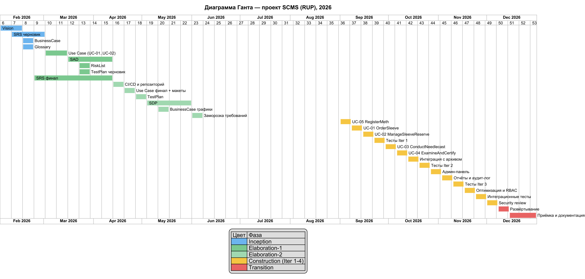

# Software Development Plan

## План разработки продукта

---

# 1. Introduction (Введение)

Документ содержит план разработки корпоративной информационной системы управления клиникой Sleeving (SCMS). Описаны организация проекта, процессы управления, расписание, бюджет и ресурсы.

## 1.1 Purpose (Назначение)

Назначение документа — определить организационную структуру, роли, процессы, расписание и бюджет для успешной реализации проекта SCMS. Документ используется проектной командой для планирования и контроля разработки.

## 1.2 Scope (Область применения)

Документ относится к проекту SCMS — разработке системы управления элитной клиникой переноса сознания в Бей-Сити. Применим ко всем фазам разработки: от анализа требований до ввода в эксплуатацию.

## 1.3 Definitions, Acronyms and Abbreviations (Определения и аббревиатуры)

| Термин / Аббревиатура | Определение | Используется в документах |
|----------------------|-------------|--------------------------|
| SCMS | Sleeving Clinic Management System — разрабатываемая система. | Все документы проекта |
| Stack / Кортикальный стек | Устройство хранения сознания, имплантируемое в затылок. | Vision, SRS, Glossary |
| Sleeve | Клонированное или подобранное тело для переноса сознания. | Vision, SRS, Glossary |
| Meth | Сверхбогатый клиент клиники, владелец множества стеков. | Vision, SRS, Glossary |
| Needlecast | Процесс передачи сознания из стека в нейроны нового тела. | Vision, SRS, Glossary |
| DHF | Digital Human Freight — цифровые данные сознания. | Vision, SRS, Glossary |
| Stack Shock | Психосоматический шок после переноса сознания. | Vision, SRS, Glossary |
| FR | Functional Requirement — функциональное требование. | SRS, SAD, TestPlan |
| RBAC | Role-Based Access Control — ролевая модель доступа. | SRS, SAD |
| 2FA | Two-Factor Authentication — двухфакторная аутентификация. | SRS, Glossary |
| MTTR | Mean Time To Recovery — среднее время восстановления системы. | SRS, SDP, TestPlan |
| Uptime | Показатель доступности системы (95% в рабочее время). | SRS, SDP, TestPlan |
| RUP | Rational Unified Process — итерационная методология разработки. | SDP |
| UC | Use Case — прецедент (вариант использования). | Use Case Specification, SDP |

Детальные определения всех терминов приведены в документе «Glossary (Глоссарий)» проекта SCMS.

## 1.4 References (Ссылки)

- Vision (Концепция) проекта SCMS, версия 1.0.
- SRS (Спецификация требований) проекта SCMS, версия 1.0.
- Use Case Specification проекта SCMS, версия 1.0.
- Glossary (Глоссарий) проекта SCMS, версия 1.0.
- RiskList (Список рисков) проекта SCMS, версия 1.0.

## 1.5 Overview (Обзор документа)

Раздел 2 содержит обзор проекта, его цели и ожидаемые результаты. Раздел 3 описывает организацию команды и роли. Раздел 4 — оценки, план фаз и итераций, расписание, ресурсы, бюджет и диаграмму Ганта.

---

# 2. Project Overview (Обзор продукта)

## 2.1 Project Purpose, Scope, and Objectives (Назначение, цели и контекст продукта)

Проект направлен на разработку SCMS — корпоративной системы для автоматизации процессов элитной клиники sleeving: учёт тел, резервирование, планирование процедур, мониторинг needlecast, пост-трансферная валидация и генерация сертификатов.

**Цели разработки:**
1. Обеспечить централизованный учёт всех sleeves и стеков клиники.
2. Автоматизировать процесс бронирования и культивирования тел.
3. Обеспечить мониторинг процедуры needlecast в реальном времени.
4. Реализовать постпроцедурное наблюдение с фиксацией результатов и авто-генерацией сертификатов.
5. Предоставить Meth защищённый личный кабинет для отслеживания статуса кейса.

## 2.2 Assumptions and Constraints (Влияющие факторы и ограничения)

- Технологический стек: Java (backend, Spring Boot), TypeScript (frontend, React), PostgreSQL.
- Развёртывание: сервер helios.cs.ifmo.ru (FreeBSD, OpenJDK 21, Node.js 22).
- Срок разработки: 2 учебных семестра (февраль — декабрь 2026, ~10 месяцев, 34 активные недели).
- Бюджет: 6 000 000 кредитов (расчёт в разделе 4).
- Документация ведётся на русском и английском языках (билингвальный формат).
- Требования заморожены по завершении фазы Elaboration (июнь 2026).

## 2.3 Project Deliverables (Ожидаемые результаты проекта)

- Документация: Vision, SRS, SAD, SDP, TestPlan, RiskList, Glossary, BusinessCase, Use Case Specification.
- Исходный код: backend API (Java) + frontend (React) + инфраструктура развёртывания (Docker Compose, CI/CD).
- Набор автоматических тестов: unit, integration, e2e.
- Инсталляционный пакет для развёртывания на сервере.

## 2.4 Evolution of the Software Development Plan (План развития данного документа)

Документ обновляется по завершении каждой итерации или при значимых изменениях объёма/расписания.

---

# 3. Project Organization (Организация проекта)

## 3.1 Organizational Structure (Структура команды разработки)

Команда проекта — два участника (Студент 1 и Студент 2). Роли распределены по RUP; каждая роль ведётся отдельно, без объединения ролей в одной позиции:

- **Студент 1** — Project Manager, System Analyst, QA Engineer.
- **Студент 2** — Software Architect, Software Engineer, DevOps Engineer.

## 3.2 External Interfaces (Внешние интерфейсы)

| Интерфейс | Описание | Формат взаимодействия |
|-----------|----------|----------------------|
| Заказчик | Лоренс Банкрофт (владелец клиники) — утверждение требований и приёмка | Личные встречи, Telegram, Email |
| Преподаватель | Курс «Основы программной инженерии» — методическое руководство | Консультации, код-ревью документации |
| Преподаватель (консультант) | Экспертиза по архитектурным решениям | Консультации по SAD |
| Генетические архивы | Внешние API для заказа культивирования sleeves | REST API, JSON |
| Протекторат Бей-Сити | Регулятор — требования к аудит-логам и отчётности | PDF-отчёты, электронные подписи |

## 3.3 Roles and Responsibilities (Роли и обязанности)

| Роль (RUP) | Обязанности | Артефакты |
|------------|-------------|-----------|
| Project Manager | Управление проектом, планирование итераций, коммуникация с заказчиком, контроль сроков и бюджета, отчётность | SDP, отчёты по итерациям |
| System Analyst | Сбор и анализ требований, документирование прецедентов, работа с заказчиком, ведение глоссария | SRS, Use Case Specification, Glossary |
| Software Architect | Проектирование архитектуры, выбор технологий, нефункциональные требования, API-контракты, схема БД | SAD, Technology Stack |
| Software Engineer | Разработка backend (Java/Spring Boot) и frontend (React), code review | Исходный код, unit-тесты |
| QA Engineer | Планирование тестирования, тест-кейсы, автоматизация, регрессия, баг-трекинг | TestPlan, тест-кейсы, баг-репорты |
| DevOps Engineer | Развёртывание, CI/CD, администрирование сервера, инфраструктура | CI/CD pipeline, Docker Compose, инструкция развёртывания |

---

# 4. Management Process (Процесс управления)

## 4.1 Project Estimates (Оценка сроков разработки проекта)

Метод оценки: аналогия с проектами аналогичной сложности (учебное веб-приложение средней сложности, 2 участника, RUP).

| Параметр | Значение |
|----------|----------|
| Период проекта | 02.02.2026 — 31.12.2026 |
| Активные периоды | Семестр 1: февраль — июнь 2026 (W01–W18); Семестр 2: сентябрь — декабрь 2026 (W19–W34) = 34 недели |
| Летний перерыв | июнь — август 2026 (работы не ведутся) |
| Трудозатраты | 1 600 чел.-ч (см. §4.2.4) |
| Бюджет разработки | 6 000 000 кредитов |
| Инфраструктура | 20 000 кредитов (сервер, 4 мес.) |
| Риск-буфер | 300 000 кредитов (5 %) |

## 4.2 Project Plan (План проекта)

### 4.2.1 Phase Plan (План фаз)

| Фаза | Период | Итерации | Ключевые результаты | Артефакты |
|------|--------|----------|---------------------|-----------|
| Inception | 02.02 — 22.02.2026 | 1 (W01–W03) | Цели, стек, команда, бюджет | Vision v1, SRS черновик, SDP черновик, BusinessCase |
| Elaboration | 23.02 — 07.06.2026 | 2 (E1: W04–W10; E2: W11–W18) | Архитектура, детальные требования, заморозка | SAD, SRS финал, Use Case, TestPlan, RiskList, Glossary, SDP |
| Летний перерыв | 08.06 — 31.08.2026 | — | Работы не ведутся | — |
| Construction | 01.09 — 07.12.2026 | 4 (C1: W19–W22; C2: W23–W26; C3: W27–W29; C4: W30–W32) | Реализация всего функционала | Инкременты v0.1 → v1.0-rc |
| Transition | 08.12 — 31.12.2026 | 1 (W33–W34) | Развёртывание, приёмка | v1.0, руководства, акт приёмки |

**Вехи:**

| Веха | Дата | Событие |
|------|------|---------|
| M1 | 22.02.2026 | Inception закрыта |
| M2 | 12.04.2026 | Elaboration-1 закрыта (SAD v1, SRS финал, Use Case) |
| M3 | 07.06.2026 | Elaboration-2 закрыта (SDP baseline, заморозка требований) |
| M4 | 28.09.2026 | v0.1: регистрация, заказ тела, резерв |
| M5 | 26.10.2026 | v0.5: перенос, осмотр и сертификация, интеграция с архивом |
| M6 | 16.11.2026 | v0.7: админ-панель, отчёты, аудит |
| M7 | 07.12.2026 | v1.0-rc: оптимизация, тесты, security review |
| M8 | 31.12.2026 | v1.0: развёртывание, приёмка |

### 4.2.2 Iteration Objectives (Цели итераций)

| Фаза | Номер итерации | Описание | Вехи |
|------|----------------|----------|------|
| Inception | I1 (W01–W03) | Анализ предметной области: цели, стек, команда, бюджет, черновики документов | Vision v1, SRS черновик, SDP черновик, BusinessCase (M1) |
| Elaboration | E1 (W04–W10) | Проектирование архитектуры, детальные требования, документирование прецедентов | SAD v1, SRS финал, Use Case, RiskList (M2) |
| Elaboration | E2 (W11–W18) | Финализация документации, макеты интерфейсов, план тестирования, baseline SDP | TestPlan, Glossary, RiskList финал, SDP v1, заморозка требований (M3) |
| Construction | C1 (W19–W22) | Аутентификация и регистрация, каталог тел, заказ, пополнение резерва | v0.1 (M4) |
| Construction | C2 (W23–W26) | Перенос сознания, осмотр и сертификация, интеграция с генетическим архивом | v0.5 (M5) |
| Construction | C3 (W27–W29) | Админ-панель, отчёты, аудит-лог, уведомления | v0.7 (M6) |
| Construction | C4 (W30–W32) | Оптимизация, RBAC, интеграционные тесты, security review | v1.0-rc (M7) |
| Transition | T1 (W33–W34) | Развёртывание, приёмочное тестирование, документация, обучение | v1.0 (M8) |

**Задачи по неделям**

**Семестр 1 (февраль — июнь 2026):**

| Нед. | Период | Фаза / Итерация | Задачи недели | Артефакт |
|------|--------|-----------------|---------------|----------|
| W01 | 02.02–08.02 | Inception | цели, стек, команда, бюджет. Vision разд. 1–3 | Vision черновик |
| W02 | 09.02–15.02 | Inception | Vision разд. 4–9. SRS разд. 1–2 | Vision v1 |
| W03 | 16.02–22.02 | Inception | Business Case. SDP черновик (фазы, бюджет) | BusinessCase, SDP черновик |
| W04 | 23.02–01.03 | Elaboration-1 | SRS разд. 3 — функциональные требования FR-001…FR-022 | SRS черновик |
| W05 | 02.03–08.03 | Elaboration-1 | Use Case: UC-01 OrderSleeve, UC-02 ManageSleeveReserve | Use Case черновик |
| W06 | 09.03–15.03 | Elaboration-1 | Use Case: UC-03, UC-04, UC-05. Глоссарий | Use Case, Glossary черновик |
| W07 | 16.03–22.03 | Elaboration-1 | SAD: компоненты, развёртывание, схема БД | SAD черновик |
| W08 | 23.03–29.03 | Elaboration-1 | RiskList (риски 1–4). TestPlan черновик | RiskList v1, TestPlan черновик |
| W09 | 30.03–05.04 | Elaboration-1 | SAD финал. API-контракты | SAD v1 |
| W10 | 06.04–12.04 | Elaboration-1 | Ревью SAD и SRS. Веха M2 | SAD финал, SRS финал |
| W11 | 13.04–19.04 | Elaboration-2 | Настройка репозитория, CI/CD. Прототип каталога | CI/CD, прототип |
| W12 | 20.04–26.04 | Elaboration-2 | Use Case финал (макеты интерфейсов). Glossary финал | Use Case финал |
| W13 | 27.04–03.05 | Elaboration-2 | TestPlan: стратегия, тест-кейсы high-priority | TestPlan v1 |
| W14 | 04.05–10.05 | Elaboration-2 | SDP: роли, итерации, расписание, бюджет, Гант | SDP обновлён |
| W15 | 11.05–17.05 | Elaboration-2 | RiskList финал. BusinessCase: цифры и графики | RiskList финал |
| W16 | 18.05–24.05 | Elaboration-2 | Ревью всех документов семестра 1 | Документы S1 |
| W17 | 25.05–31.05 | Elaboration-2 | SDP финал (baseline) | SDP v1 |
| W18 | 01.06–07.06 | Elaboration-2 | Веха M3. Заморозка требований | Базовая линия |

**Летний перерыв: 08.06 — 31.08.2026. Работы не ведутся.**

**Семестр 2 (сентябрь — декабрь 2026):**

| Нед. | Период | Фаза / Итерация | Задачи недели | Артефакт |
|------|--------|-----------------|---------------|----------|
| W19 | 01.09–07.09 | Construction-1 | UC-05 Регистрация: OAuth (backend + frontend) | UC-05 |
| W20 | 08.09–14.09 | Construction-1 | UC-01 Заказ тела: каталог, фильтры, заказ | UC-01 |
| W21 | 15.09–21.09 | Construction-1 | UC-02 Пополнение резерва: форма, приёмка | UC-02 |
| W22 | 22.09–28.09 | Construction-1 | Тесты iter 1. Веха M4 | v0.1 |
| W23 | 29.09–05.10 | Construction-2 | UC-03 Перенос: старт, результат, инциденты | UC-03 |
| W24 | 06.10–12.10 | Construction-2 | UC-04 Осмотр и сертификация: чек-лист, PDF | UC-04 |
| W25 | 13.10–19.10 | Construction-2 | Интеграция с API генетического архива | интеграция |
| W26 | 20.10–26.10 | Construction-2 | Тесты iter 2 (регрессия). Веха M5 | v0.5 |
| W27 | 27.10–02.11 | Construction-3 | Админ-панель, управление пользователями и ролями | админ-панель |
| W28 | 03.11–09.11 | Construction-3 | Отчёты, уведомления, аудит-лог | отчёты |
| W29 | 10.11–16.11 | Construction-3 | Тесты iter 3. Веха M6 | v0.7 |
| W30 | 17.11–23.11 | Construction-4 | Оптимизация, RBAC, защита данных (2FA) | оптимизация |
| W31 | 24.11–30.11 | Construction-4 | Интеграционные и e2e тесты | тесты |
| W32 | 01.12–07.12 | Construction-4 | Security review. Веха M7 | v1.0-rc |
| W33 | 08.12–14.12 | Transition | Развёртывание на сервере, CI/CD | развёртывание |
| W34 | 15.12–31.12 | Transition | Приёмочное тестирование, документация, обучение. Веха M8 | v1.0 |

### 4.2.3 Releases (Релизы)

| Версия | Дата (неделя) | Функциональный состав |
|--------|---------------|-----------------------|
| v0.1 (Alpha) | 28.09.2026 (W22) | UC-05 регистрация, UC-01 заказ тела, UC-02 пополнение резерва |
| v0.5 (Beta) | 26.10.2026 (W26) | UC-03 перенос, UC-04 осмотр и сертификация, интеграция с архивом |
| v0.7 | 16.11.2026 (W29) | Админ-панель, отчёты, аудит-лог, уведомления |
| v1.0-rc | 07.12.2026 (W32) | Оптимизация, интеграционные и e2e тесты, security review |
| v1.0 (Release) | 31.12.2026 (W34) | Полная версия, развёртывание, документация, приёмка |

### 4.2.4 Project Schedule (Расписание и трудозатраты)

**Ставки по ролям:**

| Роль (RUP) | Ставка, кредитов/час |
|------------|----------------------|
| Project Manager | 3 800 |
| System Analyst | 3 600 |
| Software Architect | 4 200 |
| Software Engineer | 3 400 |
| QA Engineer | 2 800 |
| DevOps Engineer | 3 200 |

**Трудозатраты по задачам и ролям:**

| Название задачи | Фаза | PM | Analyst | Architect | SW Engineer | QA | DevOps | Всего, ч | Стоимость, кредитов |
|-----------------|------|----|---------|-----------|-------------|----|--------|----------|---------------------|
| Vision: анализ предметной области | Inception | 20 | 40 | 0 | 0 | 0 | 0 | 60 | 220 000 |
| SRS: спецификация требований | Inception | 20 | 120 | 0 | 0 | 0 | 0 | 140 | 508 000 |
| BusinessCase | Inception | 40 | 0 | 0 | 0 | 0 | 0 | 40 | 152 000 |
| Glossary | Inception | 0 | 20 | 0 | 0 | 0 | 0 | 20 | 72 000 |
| RiskList | Elaboration | 20 | 20 | 0 | 0 | 0 | 0 | 40 | 148 000 |
| SDP: план разработки | Elaboration | 30 | 0 | 0 | 0 | 0 | 0 | 30 | 114 000 |
| Use Case Specification | Elaboration | 0 | 60 | 0 | 0 | 0 | 0 | 60 | 216 000 |
| SAD: архитектура | Elaboration | 0 | 0 | 140 | 0 | 0 | 0 | 140 | 588 000 |
| TestPlan | Elaboration | 0 | 0 | 0 | 0 | 40 | 0 | 40 | 112 000 |
| Репозиторий и CI/CD | Elaboration | 0 | 0 | 0 | 0 | 0 | 40 | 40 | 128 000 |
| UC-05 RegisterMeth | Construction | 0 | 0 | 20 | 40 | 20 | 0 | 80 | 276 000 |
| UC-01 OrderSleeve | Construction | 0 | 0 | 20 | 70 | 25 | 10 | 125 | 424 000 |
| UC-02 ManageSleeveReserve | Construction | 0 | 0 | 20 | 70 | 25 | 10 | 125 | 424 000 |
| UC-03 ConductNeedlecast | Construction | 0 | 0 | 20 | 90 | 30 | 10 | 150 | 506 000 |
| UC-04 ExamineAndCertify | Construction | 0 | 0 | 20 | 90 | 30 | 10 | 150 | 506 000 |
| Админ-панель и отчёты | Construction | 30 | 20 | 0 | 60 | 10 | 0 | 120 | 418 000 |
| Интеграция с генетическим архивом | Construction | 0 | 0 | 10 | 30 | 10 | 0 | 50 | 172 000 |
| Развёртывание на сервере | Transition | 40 | 0 | 0 | 0 | 0 | 20 | 60 | 216 000 |
| Приёмочное тестирование | Transition | 40 | 0 | 0 | 0 | 10 | 0 | 50 | 180 000 |
| Документация и обучение | Transition | 60 | 20 | 0 | 0 | 0 | 0 | 80 | 300 000 |
| **Итого, ч** | | **300** | **300** | **250** | **450** | **200** | **100** | **1 600** | **5 680 000** |

### 4.2.5 Project Resourcing (Ресурсы проекта)

#### 4.2.5.1 Staffing Plan (План по сотрудникам)

| Роль | Количество | Навыки | Требуемый опыт |
|------|-----------|--------|----------------|
| Project Manager | 1 | Управление проектами, планирование, коммуникация, контроль бюджета | Курс «Основы программной инженерии» |
| System Analyst | 1 | Сбор требований, UML, документирование | Курс «Основы программной инженерии» |
| Software Architect | 1 | Проектирование архитектуры, паттерны, Java/Spring | Опыт веб-разработки |
| Software Engineer | 1 | Java, Spring Boot, React, PostgreSQL, Docker | Опыт веб-разработки |
| QA Engineer | 1 | Тест-дизайн, автотесты, баг-трекинг | Базовые навыки тестирования |
| DevOps Engineer | 1 | FreeBSD, Docker, CI/CD | Опыт администрирования Linux/FreeBSD |

#### 4.2.5.2 Resource Acquisition Plan (План поиска сотрудников)

Команда сформирована на этапе Inception из студентов курса «Основы программной инженерии». Все роли RUP распределены между двумя участниками; поиск дополнительных сотрудников не требуется.

### 4.2.6 Budget (Бюджет)

Общий бюджет проекта: **6 000 000 кредитов** (валюта Бей-Сити, 2384 год; 1 кредит ≈ 1 рубль).

| Фаза | Трудозатраты, ч | Стоимость, кредитов | Доля | На что расходуется |
|------|-----------------|---------------------|------|--------------------|
| Inception | 260 | 952 000 | 15.9 % | Анализ, Vision, SRS черновик, BusinessCase, SDP черновик |
| Elaboration | 350 | 1 306 000 | 21.8 % | SAD, Use Case, TestPlan, RiskList, Glossary, финализация SRS и SDP |
| Construction | 800 | 2 726 000 | 45.4 % | Реализация UC-01…UC-05, админ-панель, интеграция, тесты |
| Transition | 190 | 696 000 | 11.6 % | Развёртывание, приёмочное тестирование, документация, обучение |
| **Оплата труда — итого** | **1 600** | **5 680 000** | **94.7 %** | 2 участника × 10 месяцев |
| Сервер и инфраструктура | — | 20 000 | 0.3 % | Хостинг сервера (4 мес. × 5 000) |
| Риск-буфер (5 %) | — | 300 000 | 5.0 % | Непредвиденные расходы; только с согласования PM |
| **ИТОГО ПРОЕКТ** | | **6 000 000** | **100 %** | |

### 4.2.7 Gantt Chart (Диаграмма Ганта)

Диаграмма содержит задачи (а не только фазы), сгруппированные по фазам RUP и итерациям.

## 4.3 Project Monitoring and Control (Мониторинг и контроль проекта)

### 4.3.1 Requirements Management Plan (План управления требованиями)

Требования фиксируются в SRS с уникальными идентификаторами FR-XXX-YY. Изменения требований проходят через Change Control Board (PM + Architect + Analyst).

### 4.3.2 Schedule Control Plan (План управления расписанием)

Еженедельный review прогресса (каждую пятницу). Для отслеживания задач используется GitLab Issue Board: [ссылка на доску задач]. Каждая задача имеет: название, описание, оценку трудозатрат, статус (To Do / In Progress / In Review / Done), приоритет (P0–P3). Репозиторий проекта содержит код, документацию и историю изменений.

### 4.3.3 Budget Control Plan (План управления бюджетом)

Бюджет контролируется через учёт трудозатрат:

- Еженедельный учёт времени в GitLab Issue Board (epics по фазам).
- Сравнение фактических трудозатрат с плановыми (§4.2.4) на каждом sprint review.
- При отклонении >20 % от плана — пересмотр объёма работ или перераспределение задач.
- Финансовые статьи (лицензии, инфраструктура) — все инструменты Open Source или предоставляются университетом.

### 4.3.4 Quality Control Plan (План управления качеством)

Code review обязателен для всех изменений. Автоматические тесты (unit + integration) перед каждым merge. Еженедельные инспекции кода для модулей работы со стеками.

### 4.3.5 Reporting Plan (План отчётности)

| Формат | Периодичность | Ответственный | Получатель | Описание |
|--------|---------------|---------------|------------|----------|
| Stand-up | Ежедневно (пн-пт) | Оба участника | Команда | 15 мин: что сделал, что делаю, блокеры |
| Sprint Review | Еженедельно (пт) | Project Manager | Заказчик | Демо завершённых функций, план на следующую неделю |
| Статус-отчёт | Еженедельно | Project Manager | Заказчик | Комментарий в GitLab Issue с описанием прогресса |
| Поэтапный отчёт | По завершении фазы | Project Manager | Заказчик, Преподаватель | Демонстрация работающей системы, отчёт о вехах |
| Финальный отчёт | Декабрь 2026 | Оба участника | Заказчик, Преподаватель | Полная документация, исходный код, результаты тестирования |

## 4.4 Risk Management plan (План управления рисками)

Управление рисками осуществляется в соответствии с документом RiskList. Project Manager проводит ежемесячный review рисков. При наступлении критического риска — экстренное совещание команды.

## 4.5 Close-out Plan (План завершения проекта)

Дата завершения проекта: декабрь 2026 года.

Критерии завершения:
- Все функциональные требования SRS реализованы.
- TestPlan выполнен: критических дефектов нет, открытые баги имеют приоритет ниже High.
- Система развёрнута на целевом сервере.
