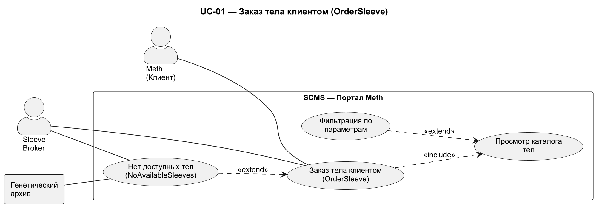
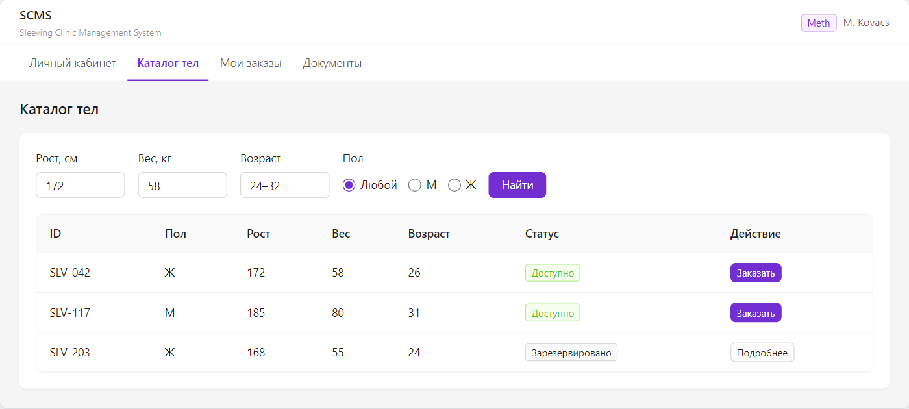
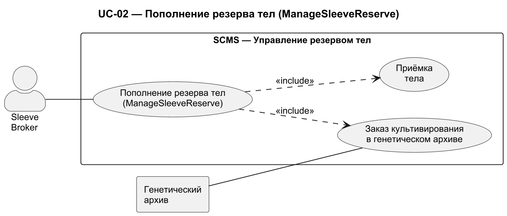
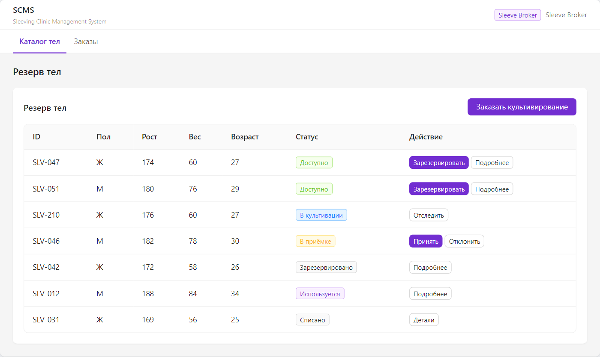
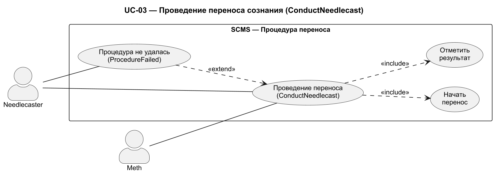
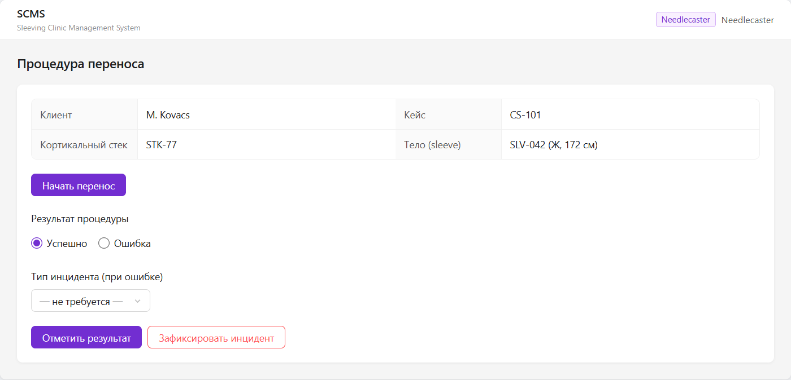
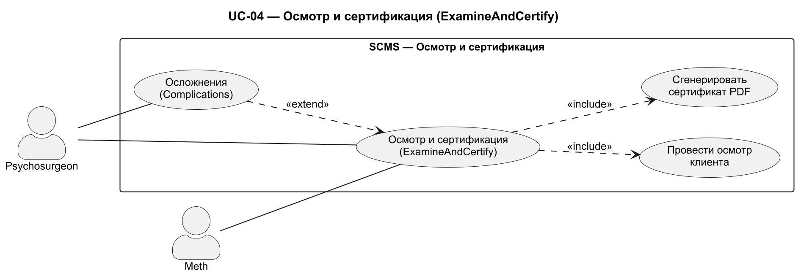
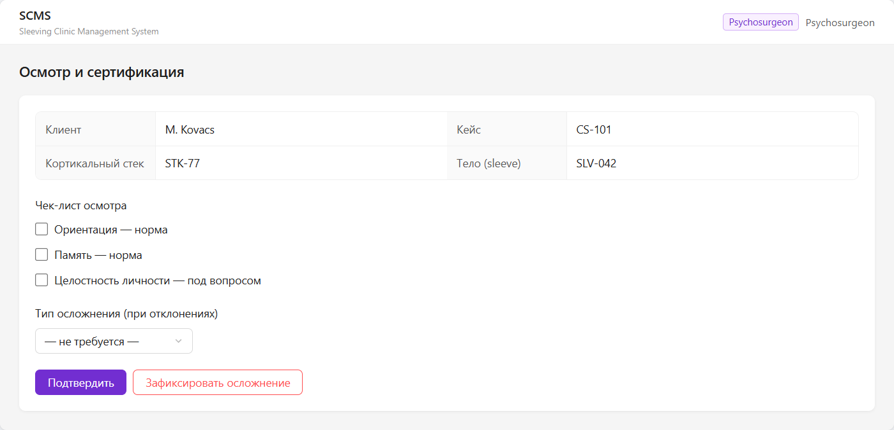
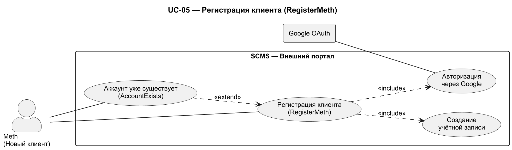
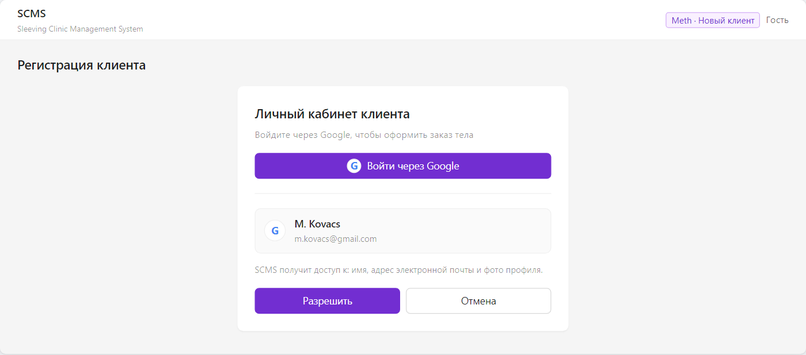

# Use Case Specification

## Описание прецедента

**Архитектурно значимые прецеденты:** UC-01 (OrderSleeve), UC-02 (ManageSleeveReserve), UC-03 (ConductNeedlecast), UC-04 (ExamineAndCertify), UC-05 (RegisterMeth) — все прецеденты являются архитектурно значимыми, так как определяют ключевые требования к производительности, безопасности и интеграции с внешними системами.

---

# UC-01. OrderSleeve — Заказ тела клиентом

## 1. Use-Case Name (Название прецедента)

OrderSleeve — заказ тела клиентом.

## 2. Actors (Акторы)

- **Главный актор:** Meth (Клиент).
- **Второстепенные акторы:** Sleeve Broker (обрабатывает заказ), Генетический архив (если тела нет в резерве).

## 3. Brief Description (Краткое описание)

Meth просматривает каталог доступных тел, выбирает подходящее и оформляет заказ. Sleeve Broker обрабатывает заказ: если подходящее тело есть в резерве — согласует операцию и резервирует тело за Meth; если тела нет — инициирует его культивирование в генетическом архиве.

## 4. Flow of Events (Последовательность событий)

### 4.1 Basic Flow (Главная последовательность)

1. Meth открывает личный кабинет.
2. Система отображает каталог доступных тел с параметрами (рост, вес, пол, возраст).
3. Meth применяет фильтры для поиска подходящего тела (рост, вес, пол, возраст).
4. Система фильтрует каталог и отображает результаты.
5. Meth выбирает тело и нажимает «Заказать».
6. Система создаёт заказ со статусом «Новый» и уведомляет Sleeve Broker.
7. Sleeve Broker открывает поступивший заказ.
8. Sleeve Broker проверяет наличие выбранного тела в резерве.

   Точка расширения: **NoAvailableSleeves** (тела нет в резерве).

9. Sleeve Broker согласует операцию с Meth.
10. Sleeve Broker нажимает «Зарезервировать», привязывая тело к Meth.
11. Система блокирует тело за клиентом и переводит заказ в статус «Подтверждён».
12. Meth отслеживает статус заказа в личном кабинете.
13. Прецедент завершён.

### 4.2 Alternative Flows (Альтернативные последовательности)

- Нет.

## 5. Preconditions (Предусловия)

- Meth зарегистрирован в системе и прошёл аутентификацию.
- Sleeve Broker авторизован в системе.

## 6. Postconditions (Постусловия)

- Тело зарезервировано за клиентом.
- Заказ переведён в статус «Подтверждён».

## 7. Extension Points (Точки расширения)

| Точка расширения | Вложенный прецедент | Условие |
| :---- | :---- | :---- |
| NoAvailableSleeves | NoAvailableSleeves | Выбранного тела нет в резерве |

### Вложенный прецедент — NoAvailableSleeves

**Условие:** подходящего тела нет в резерве клиники.
**Акторы:** главный — Sleeve Broker.

**Главная последовательность:**

1. Sleeve Broker фиксирует, что тела нет в резерве.
2. Sleeve Broker заказывает культивирование тела в генетическом архиве (прецедент ManageSleeveReserve).
3. Система переводит заказ в статус «Ожидает тело».
4. Прецедент возвращается в основной поток после поступления тела.

**Постусловия:** культивирование заказано; заказ ожидает поступления тела.

## 8. Use-case diagram (Диаграмма прецедента)

*Личный кабинет Meth: каталог тел с фильтрами и статус заказа.*

## 9. Interface example (Пример интерфейса)

*Макет личного кабинета Meth: фильтр подбора тела (рост/вес/пол/возраст), таблица доступных тел с кнопкой «Заказать» и статус заказа.*

Исходник макета: [`use-case-diagrams/uc01-OrderSleeve.html`](../use-case-diagrams/uc01-OrderSleeve.html)

**Интерфейс:** личный кабинет Meth, вкладка «Каталог тел» — экран, в котором выполняется весь основной поток прецедента.

Альтернативный поток отображается в этом же интерфейсе: при отсутствии тела в резерве (NoAvailableSleeves) заказ переводится в статус «Ожидает тело», а Sleeve Broker инициирует культивирование.

<!-- FR: FR-003-01, FR-013-01, FR-013-02 -->

---

# UC-02. ManageSleeveReserve — Пополнение резерва тел

## 1. Use-Case Name (Название прецедента)

ManageSleeveReserve — пополнение резерва тел.

## 2. Actors (Акторы)

- **Главный актор:** Sleeve Broker.
- **Второстепенные акторы:** Генетический архив (внешняя система).

## 3. Brief Description (Краткое описание)

Независимый от заказов клиентов процесс: Sleeve Broker время от времени пополняет резерв клиники — заказывает культивирование конкретных тел в генетическом архиве через API, принимает поступившие тела и ставит их в резерв. Генетический архив либо выделяет готовое тело со своего склада, либо запускает выращивание нового.

## 4. Flow of Events (Последовательность событий)

### 4.1 Basic Flow (Главная последовательность)

1. Sleeve Broker открывает раздел «Резерв тел».
2. Система отображает текущий резерв и статусы тел.
3. Sleeve Broker нажимает «Заказать культивирование».
4. Система открывает форму заказа: выбор генетического архива и параметры тела.
5. Sleeve Broker выбирает архив, задаёт параметры (рост, вес, пол, возраст) и подтверждает заказ.
6. Система отправляет запрос в API генетического архива.
7. Генетический архив подтверждает заказ: либо выделяет готовое тело со своего склада, либо запускает выращивание нового.
8. Система создаёт запись тела со статусом «В культивации».
9. Система уведомляет Sleeve Broker о смене статуса.
10. По поступлении тела Sleeve Broker открывает раздел «Приёмка».
11. Sleeve Broker проверяет параметры поступившего тела.
12. Sleeve Broker нажимает «Принять» (или «Отклонить»).
13. Система переводит тело в статус «Доступно» и добавляет его в резерв.
14. Прецедент завершён.

### 4.2 Alternative Flows (Альтернативные последовательности)

- Нет.

## 5. Preconditions (Предусловия)

- Sleeve Broker авторизован в системе.

## 6. Postconditions (Постусловия)

- Тело доступно в резерве клиники.
- Статус тела и аудит-лог обновлены.

## 7. Extension Points (Точки расширения)

Вложенных прецедентов нет.

## 8. Use-case diagram (Диаграмма прецедента)

*Резерв тел: форма заказа культивирования (выбор генетического архива и параметров) и таблица резерва с приёмкой тела.*

## 9. Interface example (Пример интерфейса)

*Макет панели Sleeve Broker: форма заказа культивирования (генетический архив, параметры тела) и таблица резерва со статусами и действием «Принять».*

Исходник макета: [`use-case-diagrams/uc02-ManageSleeveReserve.html`](../use-case-diagrams/uc02-ManageSleeveReserve.html)

**Интерфейс:** панель Sleeve Broker, вкладка «Каталог sleeves» — рабочий экран управления резервом тел.

Генетический архив либо выделяет готовое тело со своего склада, либо выращивает новое; отдельных альтернативных последовательностей у прецедента нет.

<!-- FR: FR-001-01, FR-001-02, FR-001-03, FR-002-01, FR-002-02 -->

---

# UC-03. ConductNeedlecast — Проведение переноса сознания

## 1. Use-Case Name (Название прецедента)

ConductNeedlecast — проведение переноса сознания (needlecast).

## 2. Actors (Акторы)

- **Главный актор:** Needlecaster.
- **Второстепенные акторы:** Meth (статус кейса обновляется).

## 3. Brief Description (Краткое описание)

Needlecaster проводит процедуру переноса сознания: открывает кейс клиента, фиксирует начало переноса, по завершении отмечает результат. Система сохраняет протокол и переводит кейс в статус «Перенос завершён».

## 4. Flow of Events (Последовательность событий)

### 4.1 Basic Flow (Главная последовательность)

1. Needlecaster открывает список назначенных процедур.
2. Система отображает список кейсов на сегодня.
3. Needlecaster выбирает кейс.
4. Система открывает страницу процедуры: клиент, стек, тело.
5. Needlecaster нажимает «Начать перенос».
6. Система фиксирует время начала и переводит кейс в статус «Перенос в процессе».
7. Needlecaster выполняет процедуру.
8. Needlecaster нажимает «Отметить результат» и выбирает «Успешно».

   Точка расширения: **ProcedureFailed** (перенос не удался).

9. Система фиксирует время завершения и сохраняет протокол.
10. Система переводит кейс в статус «Перенос завершён».
11. Прецедент завершён.

### 4.2 Alternative Flows (Альтернативные последовательности)

- Нет.

## 5. Preconditions (Предусловия)

- Needlecaster авторизован в системе.
- Клиент Meth имеет зарезервированное тело.
- Стек клиента доступен.

## 6. Postconditions (Постусловия)

- Протокол процедуры сохранён.
- Кейс в статусе «Перенос завершён».

## 7. Extension Points (Точки расширения)

| Точка расширения | Вложенный прецедент | Условие |
| :---- | :---- | :---- |
| ProcedureFailed | ProcedureFailed | Перенос не удался |

### Вложенный прецедент — ProcedureFailed

**Условие:** процедура в процессе, перенос не удался.
**Акторы:** главный — Needlecaster.

**Главная последовательность:**

1. Needlecaster нажимает «Зафиксировать инцидент».
2. Система запрашивает тип инцидента: stack shock / отторжение / повреждение стека.
3. Needlecaster выбирает тип и указывает описание.
4. Система сохраняет инцидент и переводит кейс в статус «Инцидент».
5. Система блокирует кейс.

**Постусловия:** инцидент зафиксирован; кейс заблокирован.

## 8. Use-case diagram (Диаграмма прецедента)

*Страница процедуры: данные клиента, кнопки «Начать перенос», «Отметить результат», «Зафиксировать инцидент».*

## 9. Interface example (Пример интерфейса)

*Макет рабочего места Needlecaster: карточка процедуры (клиент, стек, тело), кнопка «Начать перенос», выбор результата и кнопки «Отметить результат» / «Зафиксировать инцидент».*

Исходник макета: [`use-case-diagrams/uc03-ConductNeedlecast.html`](../use-case-diagrams/uc03-ConductNeedlecast.html)

**Интерфейс:** рабочее место Needlecaster, вкладка «Процедура» — экран проведения переноса сознания.

Альтернативный поток ProcedureFailed: Needlecaster нажимает «Зафиксировать инцидент», выбирает тип (stack shock / отторжение / повреждение стека) и указывает описание — кейс блокируется.

<!-- FR: FR-007-01, FR-008-01, FR-008-02 -->

---

# UC-04. ExamineAndCertify — Осмотр и сертификация

## 1. Use-Case Name (Название прецедента)

ExamineAndCertify — осмотр и сертификация клиента.

## 2. Actors (Акторы)

- **Главный актор:** Psychosurgeon.
- **Второстепенные акторы:** Meth (получает сертификат).

## 3. Brief Description (Краткое описание)

Psychosurgeon осматривает клиента после переноса на предмет stack shock и других осложнений, подтверждает успех или фиксирует осложнение. При успехе система генерирует PDF-сертификат и делает его доступным Meth.

## 4. Flow of Events (Последовательность событий)

### 4.1 Basic Flow (Главная последовательность)

1. Psychosurgeon открывает список кейсов на валидации.
2. Система отображает список кейсов, ожидающих валидации.
3. Psychosurgeon выбирает кейс.
4. Система открывает страницу: данные клиента, протокол переноса.
5. Psychosurgeon проводит осмотр (контрольные вопросы, тесты).

   Точка расширения: **Complications** (обнаружены осложнения).

6. Psychosurgeon нажимает «Подтвердить».
7. Система генерирует PDF-сертификат с QR-кодом.
8. Система делает сертификат доступным Meth.
9. Система переводит кейс в статус «Завершено».
10. Прецедент завершён.

### 4.2 Alternative Flows (Альтернативные последовательности)

- Нет.

## 5. Preconditions (Предусловия)

- Psychosurgeon авторизован в системе.
- Процедура needlecast завершена.

## 6. Postconditions (Постусловия)

- Сертификат сгенерирован и доступен Meth.
- Кейс в статусе «Завершено».

## 7. Extension Points (Точки расширения)

| Точка расширения | Вложенный прецедент | Условие |
| :---- | :---- | :---- |
| Complications | Complications | Psychosurgeon выявил отклонения при осмотре |

### Вложенный прецедент — Complications

**Условие:** Psychosurgeon выявил отклонения при осмотре.
**Акторы:** главный — Psychosurgeon; второстепенный — Meth.

**Главная последовательность:**

1. Psychosurgeon нажимает «Зафиксировать осложнение».
2. Система запрашивает тип: stack shock / фрагментация личности / отторжение.
3. Psychosurgeon выбирает тип и указывает описание.
4. Система сохраняет диагноз и создаёт инцидент.
5. Система блокирует выпуск клиента.
6. Система переводит кейс в статус «Корректирующие процедуры».
7. Система уведомляет Meth.

**Постусловия:** диагноз зафиксирован; инцидент создан; выпуск клиента заблокирован.

## 8. Use-case diagram (Диаграмма прецедента)

*Страница валидации: данные клиента, протокол переноса, кнопки «Подтвердить» и «Зафиксировать осложнение».*

## 9. Interface example (Пример интерфейса)

*Макет панели Psychosurgeon: данные кейса, чек-лист осмотра, выбор типа осложнения и кнопки «Подтвердить» / «Зафиксировать осложнение».*

Исходник макета: [`use-case-diagrams/uc04-ExamineAndCertify.html`](../use-case-diagrams/uc04-ExamineAndCertify.html)

**Интерфейс:** панель Psychosurgeon, вкладка «Кейсы на валидации» — экран осмотра и сертификации клиента.

Альтернативный поток Complications: Psychosurgeon нажимает «Зафиксировать осложнение», выбирает тип (stack shock / фрагментация личности / отторжение) и указывает описание — выпуск клиента блокируется (индикатор «Заблокирован»), кейс переводится в статус «Корректирующие процедуры».

<!-- FR: FR-009-01, FR-010-01, FR-010-02, FR-011-01, FR-011-02 -->

---

# UC-05. RegisterMeth — Регистрация клиента

## 1. Use-Case Name (Название прецедента)

RegisterMeth — регистрация клиента через Google OAuth.

## 2. Actors (Акторы)

- **Главный актор:** Meth (новый клиент).
- **Второстепенные акторы:** Google OAuth (внешняя система).

## 3. Brief Description (Краткое описание)

Новый клиент регистрируется на внешнем портале через Google OAuth: система перенаправляет его на страницу Google, клиент подтверждает доступ, система создаёт учётную запись на основе данных Google-аккаунта.

## 4. Flow of Events (Последовательность событий)

### 4.1 Basic Flow (Главная последовательность)

1. Meth открывает публичную страницу клиники.
2. Meth нажимает «Войти через Google».
3. Система перенаправляет Meth на страницу авторизации Google.
4. Meth выбирает Google-аккаунт и подтверждает доступ.
5. Google возвращает системе токен авторизации.
6. Система получает данные Meth из Google (имя, email, аватар).

   Точка расширения: **AccountExists** (email уже зарегистрирован).

7. Система создаёт учётную запись Meth.
8. Система создаёт личный кабинет Meth.
9. Meth получает доступ к личному кабинету с каталогом тел.
10. Прецедент завершён.

### 4.2 Alternative Flows (Альтернативные последовательности)

- Нет.

## 5. Preconditions (Предусловия)

- Meth не зарегистрирован в системе.
- Meth имеет Google-аккаунт.

## 6. Postconditions (Постусловия)

- Учётная запись Meth создана через Google OAuth.
- Meth имеет доступ к личному кабинету.

## 7. Extension Points (Точки расширения)

| Точка расширения | Вложенный прецедент | Условие |
| :---- | :---- | :---- |
| AccountExists | AccountExists | Email из Google уже зарегистрирован |

### Вложенный прецедент — AccountExists

**Условие:** email из Google уже зарегистрирован в системе.
**Акторы:** главный — Meth (новый клиент).

**Главная последовательность:**

1. Система проверяет уникальность email, полученного из Google.
2. Система находит существующую учётную запись.
3. Система перенаправляет Meth на вход в существующий личный кабинет.

**Постусловия:** новая учётная запись не создана; Meth входит в существующий кабинет.

## 8. Use-case diagram (Диаграмма прецедента)

*Публичная страница регистрации: вход через Google OAuth.*

## 9. Interface example (Пример интерфейса)

*Макет публичной страницы: кнопка «Войти через Google», экран подтверждения доступа Google (имя, email, аватар).*

Исходник макета: [`use-case-diagrams/uc05-RegisterMeth.html`](../use-case-diagrams/uc05-RegisterMeth.html)

**Интерфейс:** публичная страница клиники — точка входа для незарегистрированного Meth.

Альтернативный поток: если email уже зарегистрирован (AccountExists), Meth перенаправляется на вход в существующий личный кабинет.

<!-- FR: FR-014-01, FR-014-02 -->

//Интерфейсы должны покрывать все тексты
//Одна большая диаграмма должна связывать все use case

