# Use Case Specification

## Описание прецедента

**Архитектурно значимые прецеденты:** UC-01 (OrderSleeve), UC-02 (ManageSleeveReserve), UC-03 (ConductNeedlecast), UC-04 (ExamineAndCertify), UC-05 (RegisterMeth) — все прецеденты являются архитектурно значимыми, так как определяют ключевые требования к производительности, безопасности и интеграции с внешними системами.

## Общая диаграмма прецедентов (Overall Use-Case Diagram)

Сводная диаграмма связывает все пять прецедентов в единый процесс обслуживания клиента. Поток выполнения читается слева направо: регистрация (`UC-05`) и пополнение резерва (`UC-02`) → заказ тела (`UC-01`) → перенос сознания (`UC-03`) → осмотр и сертификация (`UC-04`).

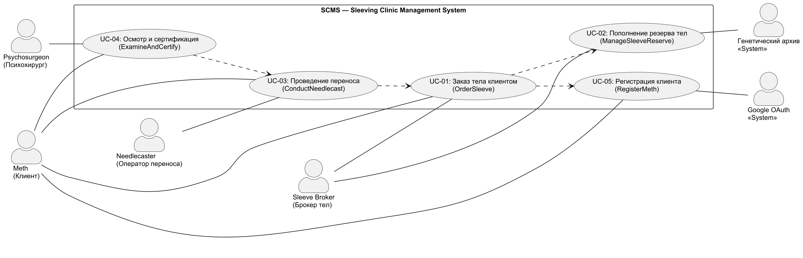

Исходник диаграммы: [`use-case-diagrams/uc00-Overview.puml`](../use-case-diagrams/uc00-Overview.puml)

---

# UC-01. OrderSleeve — Заказ тела клиентом

## 1. Use-Case Name (Название прецедента)

OrderSleeve — заказ тела клиентом.

## 2. Actors (Акторы)

- **Главный актор:** Meth (Клиент).
- **Второстепенные акторы:** Sleeve Broker (обрабатывает заказ), Генетический архив (если тела нет в резерве).

## 3. Brief Description (Краткое описание)

Meth просматривает каталог доступных тел, выбирает подходящее и оформляет заказ. Sleeve Broker обрабатывает заказ: если подходящее тело есть в резерве — согласует операцию и резервирует тело за Meth; если тела нет — инициирует его культивирование в генетическом архиве.

## 4. Flow of Events (Последовательность событий)

### 4.1 Basic Flow (Главная последовательность)

1. Meth открывает личный кабинет.
2. Система отображает каталог доступных тел с параметрами (рост, вес, пол, возраст).
3. Meth применяет фильтры для поиска подходящего тела (рост, вес, пол, возраст).
4. Система фильтрует каталог и отображает результаты.
5. Meth выбирает тело и нажимает «Заказать».
6. Система создаёт заказ со статусом «Новый» и уведомляет Sleeve Broker.
7. Sleeve Broker открывает поступивший заказ.
8. Sleeve Broker проверяет наличие выбранного тела в резерве.

   Точка расширения: **NoAvailableSleeves** (тела нет в резерве).

9. Sleeve Broker согласует операцию с Meth.
10. Sleeve Broker нажимает «Зарезервировать», привязывая тело к Meth.
11. Система блокирует тело за клиентом и переводит заказ в статус «Подтверждён».
12. Meth отслеживает статус заказа в личном кабинете.
13. Прецедент завершён.

### 4.2 Alternative Flows (Альтернативные последовательности)

- Нет.

## 5. Preconditions (Предусловия)

- Meth зарегистрирован в системе и прошёл аутентификацию.
- Sleeve Broker авторизован в системе.

## 6. Postconditions (Постусловия)

- Тело зарезервировано за клиентом.
- Заказ переведён в статус «Подтверждён».

## 7. Extension Points (Точки расширения)

| Точка расширения | Вложенный прецедент | Условие |
| :---- | :---- | :---- |
| NoAvailableSleeves | NoAvailableSleeves | Выбранного тела нет в резерве |

### Вложенный прецедент — NoAvailableSleeves

**Условие:** подходящего тела нет в резерве клиники.
**Акторы:** главный — Sleeve Broker.

**Главная последовательность:**

1. Sleeve Broker фиксирует, что тела нет в резерве.
2. Sleeve Broker заказывает культивирование тела в генетическом архиве (прецедент ManageSleeveReserve).
3. Система переводит заказ в статус «Ожидает тело».
4. Прецедент возвращается в основной поток после поступления тела.

**Постусловия:** культивирование заказано; заказ ожидает поступления тела.

## 8. Use-case diagram (Диаграмма прецедента)

*Личный кабинет Meth: каталог тел с фильтрами и статус заказа.*

## 9. Interface example (Пример интерфейса)

Прецедент охватывает несколько экранов. Ниже приведены макеты всех шагов основного потока и точки расширения.

### 9.1 Каталог тел (шаги 1–5)

*Личный кабинет Meth: фильтр подбора тела (рост/вес/пол/возраст) и таблица доступных тел с кнопкой «Заказать».*

Исходник макета: [`use-case-diagrams/uc01-OrderSleeve.html`](../use-case-diagrams/uc01-OrderSleeve.html)

### 9.2 Оформление заказа (шаг 6)

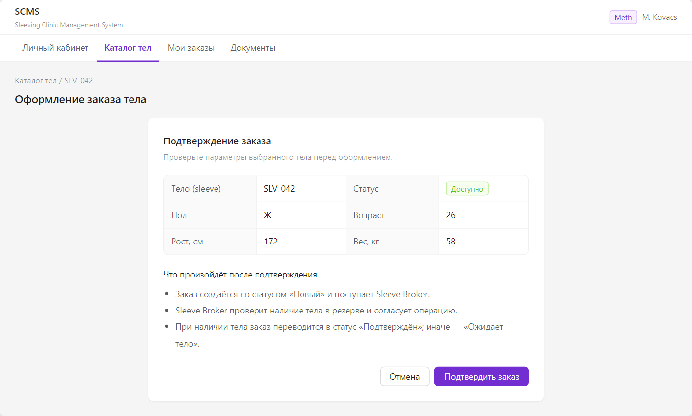

*Подтверждение выбранного тела: параметры, условия и создание заказа со статусом «Новый».*

Исходник макета: [`use-case-diagrams/uc01-OrderSleeve-order.html`](../use-case-diagrams/uc01-OrderSleeve-order.html)

### 9.3 Обработка заказа Sleeve Broker (шаги 7–11)

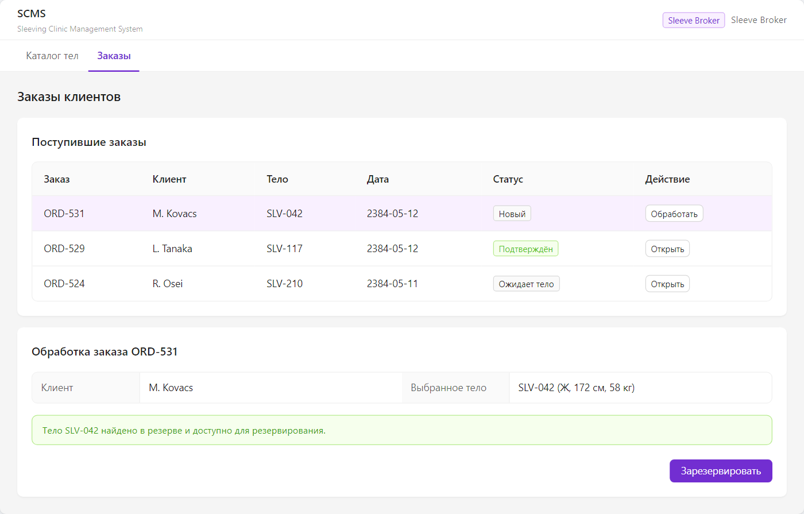

*Sleeve Broker: список поступивших заказов, проверка резерва и кнопка «Зарезервировать», переводящая заказ в статус «Подтверждён».*

Исходник макета: [`use-case-diagrams/uc01-OrderSleeve-broker.html`](../use-case-diagrams/uc01-OrderSleeve-broker.html)

### 9.4 Обработка заказа без тела — NoAvailableSleeves (шаг 8, точка расширения)

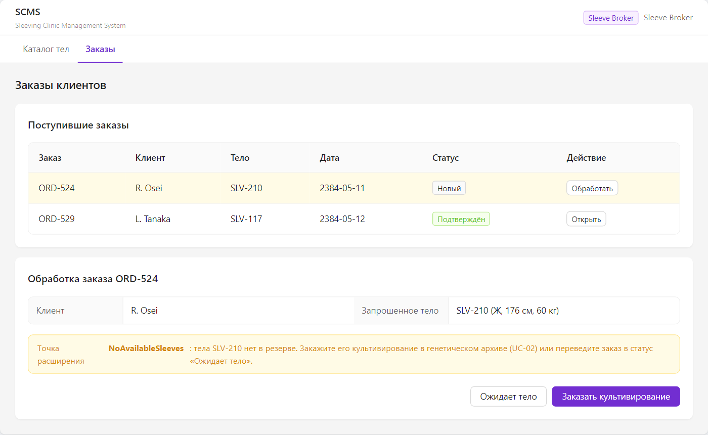

*Sleeve Broker: заказ ORD-524 (R. Osei, SLV-210). Подходящего тела нет в резерве — система предлагает «Ожидает тело» и заказ культивирования (UC-02).*

Исходник макета: [`use-case-diagrams/uc01-OrderSleeve-broker-nowait.html`](../use-case-diagrams/uc01-OrderSleeve-broker-nowait.html)

### 9.5 Статус заказа Meth — «Подтверждён» (шаги 12–13, основная последовательность)

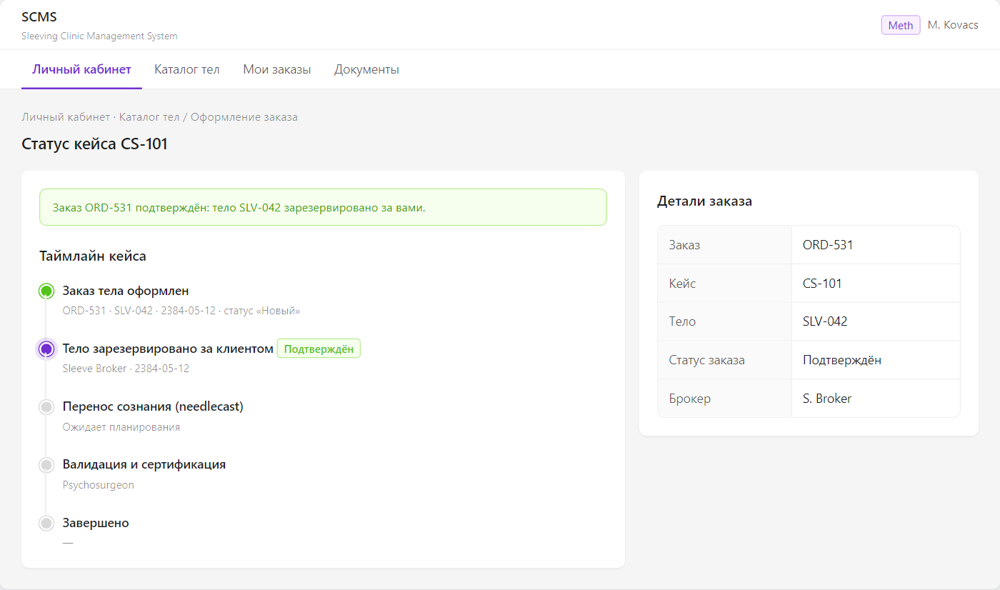

*Личный кабинет Meth: таймлайн кейса CS-101. Тело SLV-042 зарезервировано, заказ ORD-531 в статусе «Подтверждён».*

Исходник макета: [`use-case-diagrams/uc01-OrderSleeve-status.html`](../use-case-diagrams/uc01-OrderSleeve-status.html)

### 9.6 Статус заказа Meth — «Ожидает тело» (точка расширения NoAvailableSleeves)

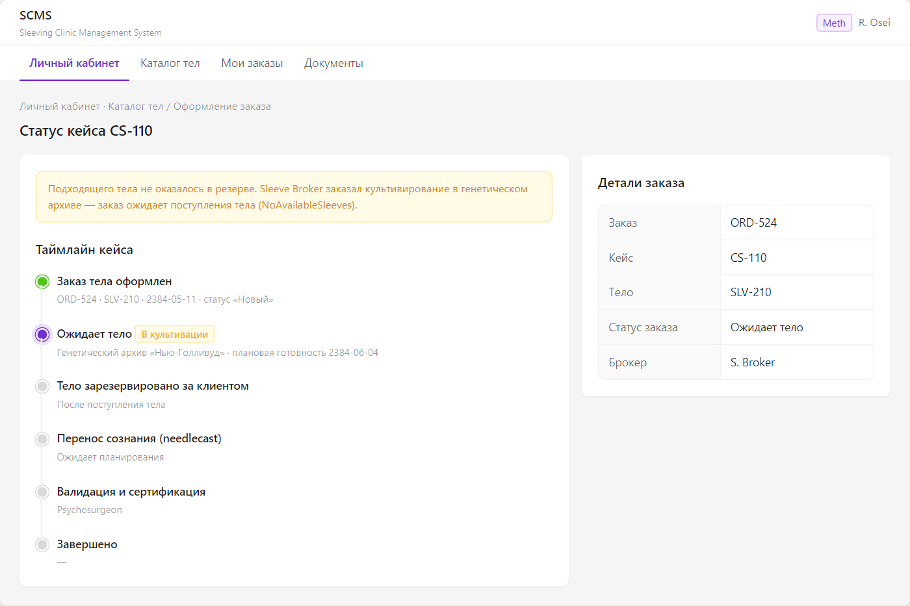

*Личный кабинет Meth: кейс CS-110 (ORD-524, тело SLV-210). Подходящего тела не было в резерве — заказано культивирование, заказ в статусе «Ожидает тело».*

Исходник макета: [`use-case-diagrams/uc01-OrderSleeve-waiting.html`](../use-case-diagrams/uc01-OrderSleeve-waiting.html)

### 9.7 Мои заказы — отслеживание статусов (шаг 12)

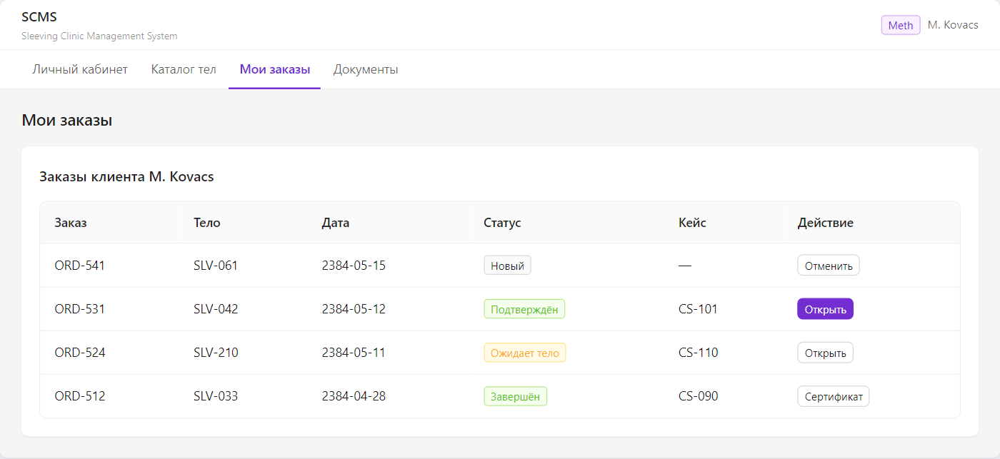

*Личный кабинет Meth: список заказов клиента во всех статусах — «Новый», «Подтверждён», «Ожидает тело», «Завершён» — с переходом к кейсу или сертификату.*

Исходник макета: [`use-case-diagrams/uc01-OrderSleeve-orders.html`](../use-case-diagrams/uc01-OrderSleeve-orders.html)

**Интерфейс:** личный кабинет Meth (каталог, оформление, мои заказы, статус кейса) и панель Sleeve Broker (обработка заказа, в том числе без тела).

<!-- FR: FR-003-01, FR-013-01, FR-013-02 -->

---

# UC-02. ManageSleeveReserve — Пополнение резерва тел

## 1. Use-Case Name (Название прецедента)

ManageSleeveReserve — пополнение резерва тел.

## 2. Actors (Акторы)

- **Главный актор:** Sleeve Broker.
- **Второстепенные акторы:** Генетический архив (внешняя система).

## 3. Brief Description (Краткое описание)

Независимый от заказов клиентов процесс: Sleeve Broker время от времени пополняет резерв клиники — заказывает культивирование конкретных тел в генетическом архиве через API, принимает поступившие тела и ставит их в резерв. Генетический архив либо выделяет готовое тело со своего склада, либо запускает выращивание нового.

## 4. Flow of Events (Последовательность событий)

### 4.1 Basic Flow (Главная последовательность)

1. Sleeve Broker открывает раздел «Резерв тел».
2. Система отображает текущий резерв и статусы тел.
3. Sleeve Broker нажимает «Заказать культивирование».
4. Система открывает форму заказа: выбор генетического архива и параметры тела.
5. Sleeve Broker выбирает архив, задаёт параметры (рост, вес, пол, возраст) и подтверждает заказ.
6. Система отправляет запрос в API генетического архива.
7. Генетический архив подтверждает заказ: либо выделяет готовое тело со своего склада, либо запускает выращивание нового.
8. Система создаёт запись тела со статусом «В культивации».
9. Система уведомляет Sleeve Broker о смене статуса.
10. По поступлении тела Sleeve Broker открывает раздел «Приёмка».
11. Sleeve Broker проверяет параметры поступившего тела.
12. Sleeve Broker нажимает «Принять» (или «Отклонить»).
13. Система переводит тело в статус «Доступно» и добавляет его в резерв.
14. Прецедент завершён.

### 4.2 Alternative Flows (Альтернативные последовательности)

- Нет.

## 5. Preconditions (Предусловия)

- Sleeve Broker авторизован в системе.

## 6. Postconditions (Постусловия)

- Тело доступно в резерве клиники.
- Статус тела и аудит-лог обновлены.

## 7. Extension Points (Точки расширения)

Вложенных прецедентов нет.

## 8. Use-case diagram (Диаграмма прецедента)

*Резерв тел: форма заказа культивирования (выбор генетического архива и параметров) и таблица резерва с приёмкой тела.*

## 9. Interface example (Пример интерфейса)

### 9.1 Резерв тел (шаги 1–2, 13)

*Панель Sleeve Broker: таблица резерва со всеми статусами тел («Доступно», «В культивации», «В приёмке», «Зарезервировано», «Используется», «Списано»), кнопкой «Заказать культивирование» и действиями «Зарезервировать» / «Принять» / «Отклонить».*

Исходник макета: [`use-case-diagrams/uc02-ManageSleeveReserve.html`](../use-case-diagrams/uc02-ManageSleeveReserve.html)

### 9.2 Заказ культивирования (шаги 3–8)

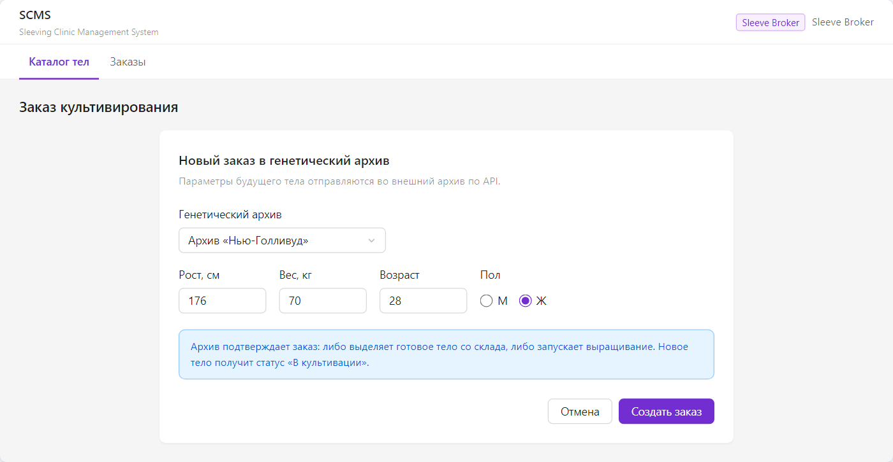

*Форма заказа: выбор генетического архива и параметров тела (рост, вес, пол, возраст), отправка запроса в API архива.*

Исходник макета: [`use-case-diagrams/uc02-ManageSleeveReserve-cultivation.html`](../use-case-diagrams/uc02-ManageSleeveReserve-cultivation.html)

### 9.3 Приёмка поступившего тела (шаги 9–13)

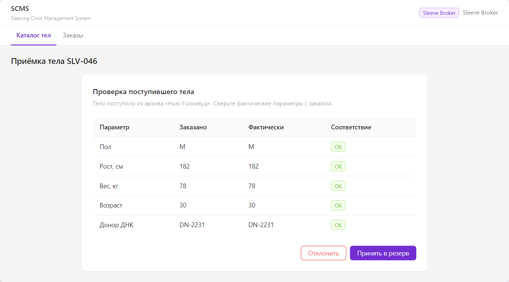

*Сверка фактических параметров поступившего тела с заказом и действия «Принять в резерв» / «Отклонить».*

Исходник макета: [`use-case-diagrams/uc02-ManageSleeveReserve-acceptance.html`](../use-case-diagrams/uc02-ManageSleeveReserve-acceptance.html)

### 9.4 Резервирование тела за клиентом (шаг 13, дополнительно)

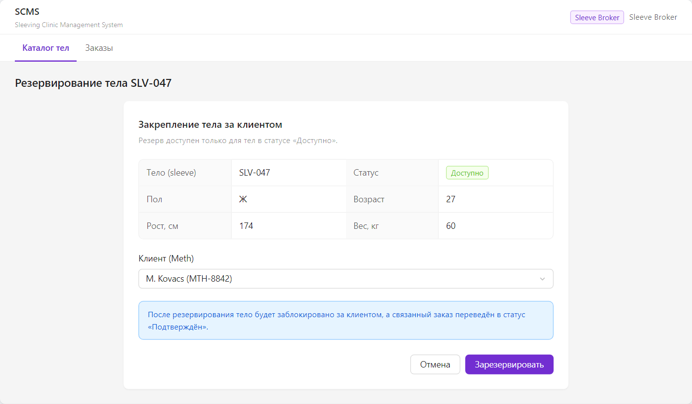

*Закрепление доступного тела SLV-047 за выбранным клиентом (Meth) с переводом связанного заказа в статус «Подтверждён».*

Исходник макета: [`use-case-diagrams/uc02-ManageSleeveReserve-reserve.html`](../use-case-diagrams/uc02-ManageSleeveReserve-reserve.html)

### 9.5 Отклонение поступившего тела (альтернатива шага 12)

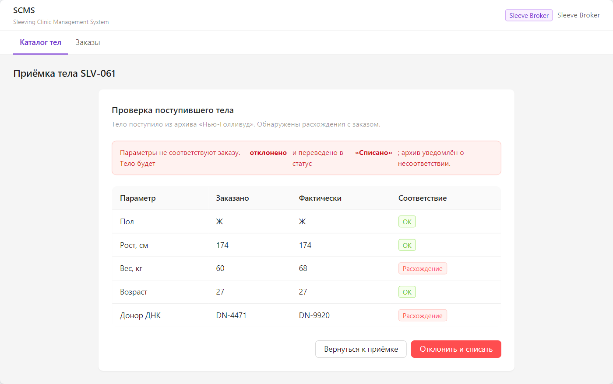

*Расхождения параметров поступившего тела с заказом: тело отклоняется и переводится в статус «Списано», архив уведомляется.*

Исходник макета: [`use-case-diagrams/uc02-ManageSleeveReserve-acceptance-rejected.html`](../use-case-diagrams/uc02-ManageSleeveReserve-acceptance-rejected.html)

**Интерфейс:** панель Sleeve Broker, раздел «Резерв тел» — резерв, заказ культивирования, приёмка (в том числе отклонение) и резервирование.

Генетический архив либо выделяет готовое тело со своего склада, либо выращивает новое; отдельных альтернативных последовательностей у прецедента нет.

<!-- FR: FR-001-01, FR-001-02, FR-001-03, FR-002-01, FR-002-02 -->

---

# UC-03. ConductNeedlecast — Проведение переноса сознания

## 1. Use-Case Name (Название прецедента)

ConductNeedlecast — проведение переноса сознания (needlecast).

## 2. Actors (Акторы)

- **Главный актор:** Needlecaster.
- **Второстепенные акторы:** Meth (статус кейса обновляется).

## 3. Brief Description (Краткое описание)

Needlecaster проводит процедуру переноса сознания: открывает кейс клиента, фиксирует начало переноса, по завершении отмечает результат. Система сохраняет протокол и переводит кейс в статус «Перенос завершён».

## 4. Flow of Events (Последовательность событий)

### 4.1 Basic Flow (Главная последовательность)

1. Needlecaster открывает список назначенных процедур.
2. Система отображает список кейсов на сегодня.
3. Needlecaster выбирает кейс.
4. Система открывает страницу процедуры: клиент, стек, тело.
5. Needlecaster нажимает «Начать перенос».
6. Система фиксирует время начала и переводит кейс в статус «Перенос в процессе».
7. Needlecaster выполняет процедуру.
8. Needlecaster нажимает «Отметить результат» и выбирает «Успешно».

   Точка расширения: **ProcedureFailed** (перенос не удался).

9. Система фиксирует время завершения и сохраняет протокол.
10. Система переводит кейс в статус «Перенос завершён».
11. Прецедент завершён.

### 4.2 Alternative Flows (Альтернативные последовательности)

- Нет.

## 5. Preconditions (Предусловия)

- Needlecaster авторизован в системе.
- Клиент Meth имеет зарезервированное тело.
- Стек клиента доступен.

## 6. Postconditions (Постусловия)

- Протокол процедуры сохранён.
- Кейс в статусе «Перенос завершён».

## 7. Extension Points (Точки расширения)

| Точка расширения | Вложенный прецедент | Условие |
| :---- | :---- | :---- |
| ProcedureFailed | ProcedureFailed | Перенос не удался |

### Вложенный прецедент — ProcedureFailed

**Условие:** процедура в процессе, перенос не удался.
**Акторы:** главный — Needlecaster.

**Главная последовательность:**

1. Needlecaster нажимает «Зафиксировать инцидент».
2. Система запрашивает тип инцидента: stack shock / отторжение / повреждение стека.
3. Needlecaster выбирает тип и указывает описание.
4. Система сохраняет инцидент и переводит кейс в статус «Инцидент».
5. Система блокирует кейс.

**Постусловия:** инцидент зафиксирован; кейс заблокирован.

## 8. Use-case diagram (Диаграмма прецедента)

*Страница процедуры: данные клиента, кнопки «Начать перенос», «Отметить результат», «Зафиксировать инцидент».*

## 9. Interface example (Пример интерфейса)

### 9.1 Список назначенных процедур (шаги 1–3)

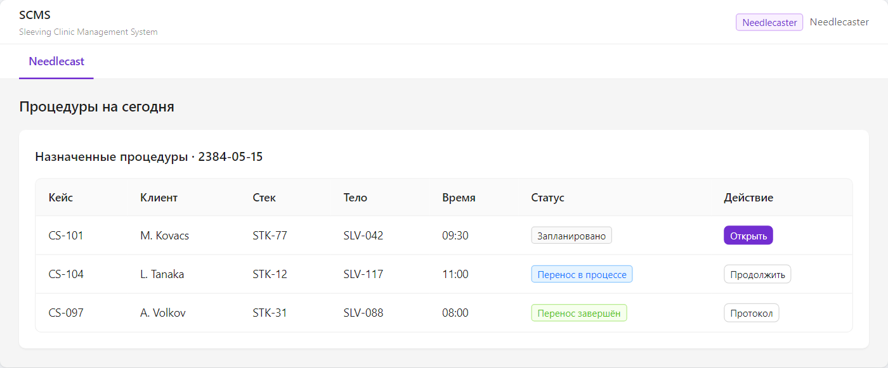

*Рабочее место Needlecaster: список кейсов на сегодня с параметрами и действием «Открыть».*

Исходник макета: [`use-case-diagrams/uc03-ConductNeedlecast-list.html`](../use-case-diagrams/uc03-ConductNeedlecast-list.html)

### 9.2 Страница процедуры — старт (шаги 4–5)

*Карточка процедуры (клиент, стек, тело), статус «Запланировано» и кнопка «Начать перенос».*

Исходник макета: [`use-case-diagrams/uc03-ConductNeedlecast.html`](../use-case-diagrams/uc03-ConductNeedlecast.html)

### 9.3 Перенос в процессе (шаги 6–8)

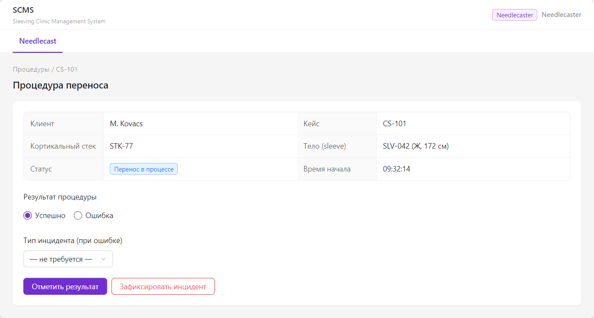

*После «Начать перенос»: время начала зафиксировано, статус «Перенос в процессе», форма отметки результата (успех/ошибка) и кнопки «Отметить результат» / «Зафиксировать инцидент».*

Исходник макета: [`use-case-diagrams/uc03-ConductNeedlecast-progress.html`](../use-case-diagrams/uc03-ConductNeedlecast-progress.html)

### 9.4 Протокол процедуры (шаги 9–11)

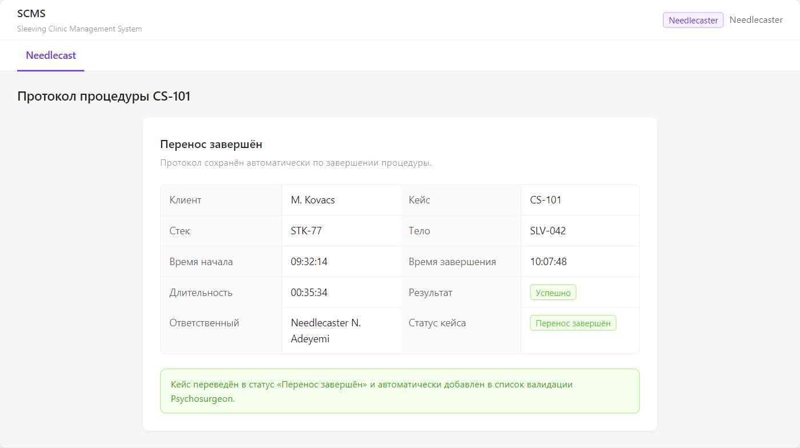

*Сохранённый протокол: время начала и завершения, длительность, результат и ответственный; статус кейса «Перенос завершён».*

Исходник макета: [`use-case-diagrams/uc03-ConductNeedlecast-protocol.html`](../use-case-diagrams/uc03-ConductNeedlecast-protocol.html)

### 9.5 Фиксация инцидента (точка расширения ProcedureFailed)

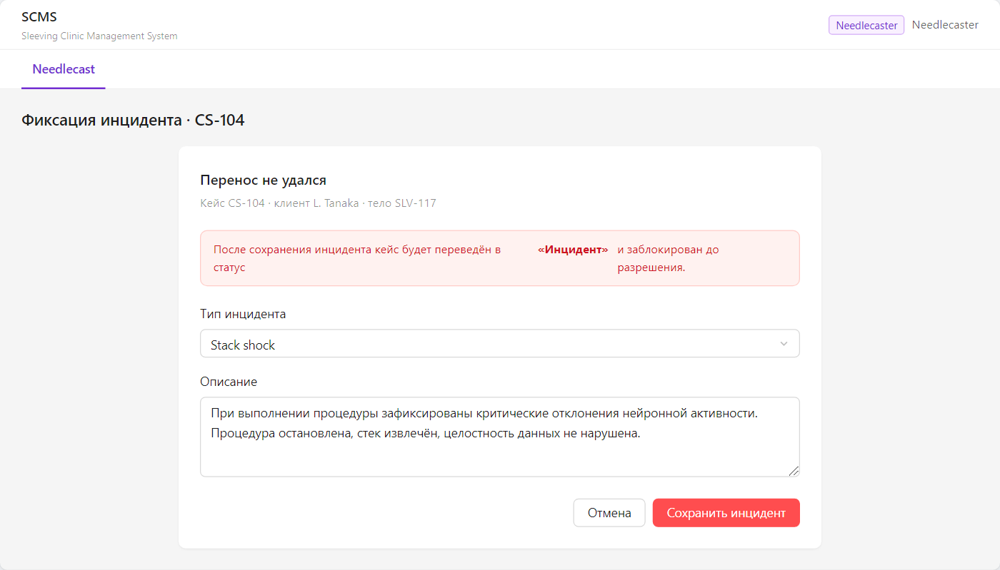

*Форма инцидента: тип (stack shock / отторжение / повреждение стека) и описание. После сохранения кейс блокируется и переводится в статус «Инцидент».*

Исходник макета: [`use-case-diagrams/uc03-ConductNeedlecast-incident.html`](../use-case-diagrams/uc03-ConductNeedlecast-incident.html)

**Интерфейс:** рабочее место Needlecaster — список процедур, проведение переноса, протокол и фиксация инцидента.

<!-- FR: FR-007-01, FR-008-01, FR-008-02 -->

---

# UC-04. ExamineAndCertify — Осмотр и сертификация

## 1. Use-Case Name (Название прецедента)

ExamineAndCertify — осмотр и сертификация клиента.

## 2. Actors (Акторы)

- **Главный актор:** Psychosurgeon.
- **Второстепенные акторы:** Meth (получает сертификат).

## 3. Brief Description (Краткое описание)

Psychosurgeon осматривает клиента после переноса на предмет stack shock и других осложнений, подтверждает успех или фиксирует осложнение. При успехе система генерирует PDF-сертификат и делает его доступным Meth.

## 4. Flow of Events (Последовательность событий)

### 4.1 Basic Flow (Главная последовательность)

1. Psychosurgeon открывает список кейсов на валидации.
2. Система отображает список кейсов, ожидающих валидации.
3. Psychosurgeon выбирает кейс.
4. Система открывает страницу: данные клиента, протокол переноса.
5. Psychosurgeon проводит осмотр (контрольные вопросы, тесты).

   Точка расширения: **Complications** (обнаружены осложнения).

6. Psychosurgeon нажимает «Подтвердить».
7. Система генерирует PDF-сертификат с QR-кодом.
8. Система делает сертификат доступным Meth.
9. Система переводит кейс в статус «Завершено».
10. Прецедент завершён.

### 4.2 Alternative Flows (Альтернативные последовательности)

- Нет.

## 5. Preconditions (Предусловия)

- Psychosurgeon авторизован в системе.
- Процедура needlecast завершена.

## 6. Postconditions (Постусловия)

- Сертификат сгенерирован и доступен Meth.
- Кейс в статусе «Завершено».

## 7. Extension Points (Точки расширения)

| Точка расширения | Вложенный прецедент | Условие |
| :---- | :---- | :---- |
| Complications | Complications | Psychosurgeon выявил отклонения при осмотре |

### Вложенный прецедент — Complications

**Условие:** Psychosurgeon выявил отклонения при осмотре.
**Акторы:** главный — Psychosurgeon; второстепенный — Meth.

**Главная последовательность:**

1. Psychosurgeon нажимает «Зафиксировать осложнение».
2. Система запрашивает тип: stack shock / фрагментация личности / отторжение.
3. Psychosurgeon выбирает тип и указывает описание.
4. Система сохраняет диагноз и создаёт инцидент.
5. Система блокирует выпуск клиента.
6. Система переводит кейс в статус «Корректирующие процедуры».
7. Система уведомляет Meth.

**Постусловия:** диагноз зафиксирован; инцидент создан; выпуск клиента заблокирован.

## 8. Use-case diagram (Диаграмма прецедента)

*Страница валидации: данные клиента, протокол переноса, кнопки «Подтвердить» и «Зафиксировать осложнение».*

## 9. Interface example (Пример интерфейса)

### 9.1 Кейсы на валидации (шаги 1–3)

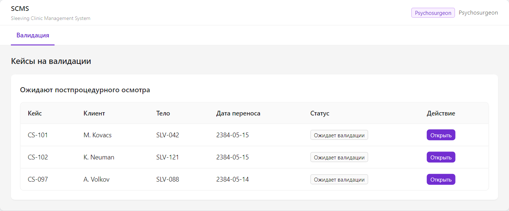

*Панель Psychosurgeon: список кейсов, ожидающих постпроцедурного осмотра, с действием «Открыть».*

Исходник макета: [`use-case-diagrams/uc04-ExamineAndCertify-list.html`](../use-case-diagrams/uc04-ExamineAndCertify-list.html)

### 9.2 Осмотр и сертификация (шаги 4–7)

*Данные кейса и протокол переноса, чек-лист осмотра, выбор типа осложнения и кнопки «Подтвердить» / «Зафиксировать осложнение».*

Исходник макета: [`use-case-diagrams/uc04-ExamineAndCertify.html`](../use-case-diagrams/uc04-ExamineAndCertify.html)

### 9.3 Сертификат совместимости (шаги 7–9)

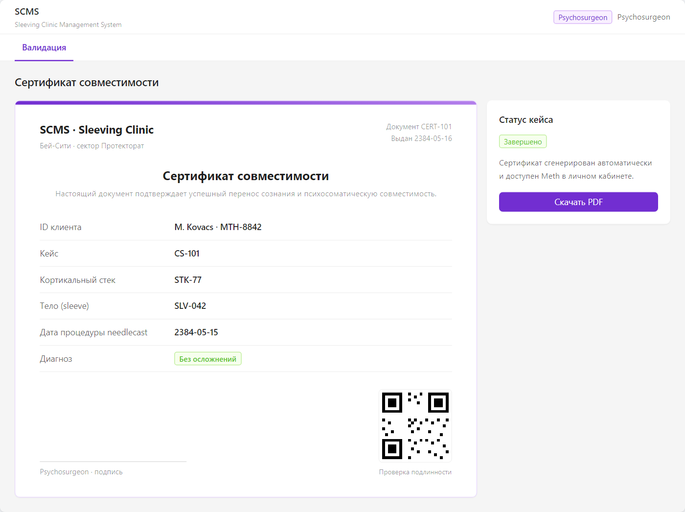

*Автоматически сгенерированный PDF-сертификат: реквизиты клиники, ID клиента, даты процедур и QR-код для проверки подлинности; сертификат доступен Meth.*

Исходник макета: [`use-case-diagrams/uc04-ExamineAndCertify-certificate.html`](../use-case-diagrams/uc04-ExamineAndCertify-certificate.html)

### 9.4 Документы у Meth — доступный сертификат (шаг 8)

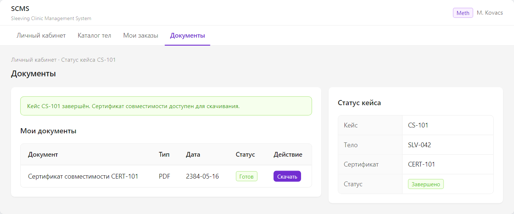

*Личный кабинет Meth, раздел «Документы»: сертификат совместимости CERT-101 доступен для скачивания; кейс CS-101 в статусе «Завершено».*

Исходник макета: [`use-case-diagrams/uc04-ExamineAndCertify-meth-certificate.html`](../use-case-diagrams/uc04-ExamineAndCertify-meth-certificate.html)

### 9.5 Фиксация осложнения (точка расширения Complications)

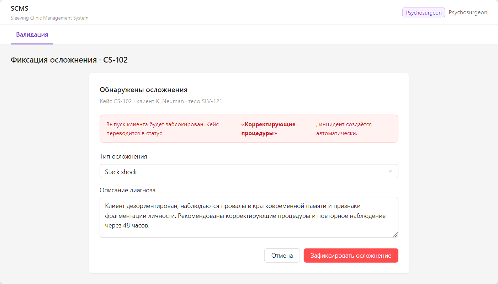

*Форма осложнения: тип (stack shock / фрагментация личности / отторжение), описание и контрольные точки. Выпуск клиента блокируется, кейс переводится в статус «Корректирующие процедуры».*

Исходник макета: [`use-case-diagrams/uc04-ExamineAndCertify-complication.html`](../use-case-diagrams/uc04-ExamineAndCertify-complication.html)

**Интерфейс:** панель Psychosurgeon — кейсы на валидации, осмотр, сертификат и фиксация осложнения.

<!-- FR: FR-009-01, FR-010-01, FR-010-02, FR-011-01, FR-011-02 -->

---

# UC-05. RegisterMeth — Регистрация клиента

## 1. Use-Case Name (Название прецедента)

RegisterMeth — регистрация клиента через Google OAuth.

## 2. Actors (Акторы)

- **Главный актор:** Meth (новый клиент).
- **Второстепенные акторы:** Google OAuth (внешняя система).

## 3. Brief Description (Краткое описание)

Новый клиент регистрируется на внешнем портале через Google OAuth: система перенаправляет его на страницу Google, клиент подтверждает доступ, система создаёт учётную запись на основе данных Google-аккаунта.

## 4. Flow of Events (Последовательность событий)

### 4.1 Basic Flow (Главная последовательность)

1. Meth открывает публичную страницу клиники.
2. Meth нажимает «Войти через Google».
3. Система перенаправляет Meth на страницу авторизации Google.
4. Meth выбирает Google-аккаунт и подтверждает доступ.
5. Google возвращает системе токен авторизации.
6. Система получает данные Meth из Google (имя, email, аватар).

   Точка расширения: **AccountExists** (email уже зарегистрирован).

7. Система создаёт учётную запись Meth.
8. Система создаёт личный кабинет Meth.
9. Meth получает доступ к личному кабинету с каталогом тел.
10. Прецедент завершён.

### 4.2 Alternative Flows (Альтернативные последовательности)

- Нет.

## 5. Preconditions (Предусловия)

- Meth не зарегистрирован в системе.
- Meth имеет Google-аккаунт.

## 6. Postconditions (Постусловия)

- Учётная запись Meth создана через Google OAuth.
- Meth имеет доступ к личному кабинету.

## 7. Extension Points (Точки расширения)

| Точка расширения | Вложенный прецедент | Условие |
| :---- | :---- | :---- |
| AccountExists | AccountExists | Email из Google уже зарегистрирован |

### Вложенный прецедент — AccountExists

**Условие:** email из Google уже зарегистрирован в системе.
**Акторы:** главный — Meth (новый клиент).

**Главная последовательность:**

1. Система проверяет уникальность email, полученного из Google.
2. Система находит существующую учётную запись.
3. Система перенаправляет Meth на вход в существующий личный кабинет.

**Постусловия:** новая учётная запись не создана; Meth входит в существующий кабинет.

## 8. Use-case diagram (Диаграмма прецедента)

*Публичная страница регистрации: вход через Google OAuth.*

## 9. Interface example (Пример интерфейса)

### 9.1 Публичная страница и вход через Google (шаги 1–6)

*Публичная страница клиники: кнопка «Войти через Google» и экран подтверждения доступа (имя, email, аватар).*

Исходник макета: [`use-case-diagrams/uc05-RegisterMeth.html`](../use-case-diagrams/uc05-RegisterMeth.html)

### 9.2 Личный кабинет клиента (шаги 7–9)

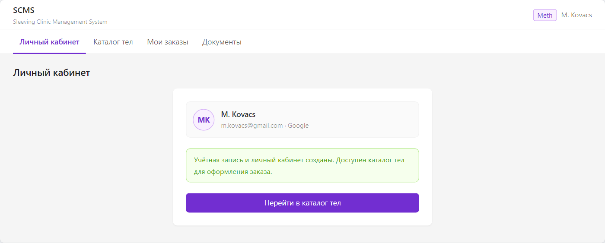

*Личный кабинет Meth после создания учётной записи: профиль из Google и доступ к каталогу тел.*

Исходник макета: [`use-case-diagrams/uc05-RegisterMeth-cabinet.html`](../use-case-diagrams/uc05-RegisterMeth-cabinet.html)

### 9.3 AccountExists (точка расширения)

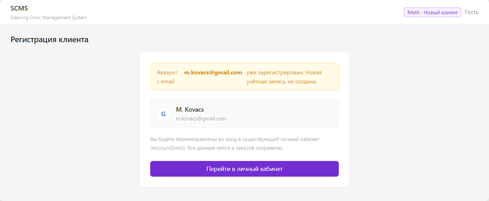

*Если email из Google уже зарегистрирован, новая учётная запись не создаётся — Meth перенаправляется на вход в существующий личный кабинет.*

Исходник макета: [`use-case-diagrams/uc05-RegisterMeth-account-exists.html`](../use-case-diagrams/uc05-RegisterMeth-account-exists.html)

**Интерфейс:** публичная страница клиники и личный кабинет Meth.

<!-- FR: FR-014-01, FR-014-02 -->

---

# Карта переходов (сквозной сценарий)

## Основной путь (happy-path: клиент M. Kovacs, кейс CS-101)

UC-05 регистрация → UC-01 каталог → UC-01 оформление заказа → UC-01 обработка брокером (резерв) → UC-01 статус «Подтверждён» → UC-03 список процедур → UC-03 старт → UC-03 перенос в процессе → UC-03 протокол → UC-04 список на валидации → UC-04 осмотр (Подтвердить) → UC-04 сертификат → UC-04 документы у Meth (скачивание).

## Ветка NoAvailableSleeves (клиент R. Osei, кейс CS-110)

UC-01 оформление заказа → UC-01 обработка брокером — тела нет в резерве (`uc01-OrderSleeve-broker-nowait`) → UC-02 заказ культивирования → UC-01 статус «Ожидает тело» → [поступление тела] → UC-02 приёмка → далее основной путь.

## Ветки-исключения

- **ProcedureFailed:** UC-03 перенос в процессе → «Зафиксировать инцидент» → кейс в статусе «Инцидент» (заблокирован).
- **Complications:** UC-04 осмотр → «Зафиксировать осложнение» → кейс «Корректирующие процедуры» (выпуск заблокирован).
- **AccountExists:** UC-05 вход через Google → существующий личный кабинет.

## Таблица экранов и переходов

| UC | Экран | Исходник | Откуда | Действие | Куда |
| :-- | :-- | :-- | :-- | :-- | :-- |
| UC-05 | Публичная страница / Google | `uc05-RegisterMeth.html` | — | Войти через Google → Разрешить | Личный кабинет |
| UC-05 | AccountExists | `uc05-RegisterMeth-account-exists.html` | Публичная страница | Перейти в кабинет | существующий кабинет |
| UC-05 | Личный кабинет (создан) | `uc05-RegisterMeth-cabinet.html` | Публичная страница | Перейти в каталог тел | UC-01 каталог |
| UC-01 | Каталог тел | `uc01-OrderSleeve.html` | Кабинет / Мои заказы | Заказать | UC-01 оформление |
| UC-01 | Оформление заказа | `uc01-OrderSleeve-order.html` | Каталог | Подтвердить заказ | UC-01 обработка брокером |
| UC-01 | Мои заказы | `uc01-OrderSleeve-orders.html` | Личный кабинет | Открыть заказ | UC-01 статус «Подтверждён» / «Ожидает тело» |
| UC-01 | Обработка заказа (брокер) | `uc01-OrderSleeve-broker.html` | Оформление | Зарезервировать | UC-01 статус «Подтверждён» |
| UC-01 | Обработка без тела (NoAvailableSleeves) | `uc01-OrderSleeve-broker-nowait.html` | Обработка | «Ожидает тело» / культивирование | UC-01 статус «Ожидает тело» / UC-02 |
| UC-01 | Статус «Подтверждён» | `uc01-OrderSleeve-status.html` | Обработка | (авто) | UC-03 список процедур |
| UC-01 | Статус «Ожидает тело» | `uc01-OrderSleeve-waiting.html` | Брокер (тела нет) | — | UC-02 культивация |
| UC-02 | Резерв тел | `uc02-ManageSleeveReserve.html` | — | Культивирование / Принять / Отклонить / Зарезервировать | UC-02 культивация / приёмка / резерв |
| UC-02 | Заказ культивирования | `uc02-ManageSleeveReserve-cultivation.html` | Резерв | Создать заказ | Резерв («В культивации») |
| UC-02 | Приёмка тела | `uc02-ManageSleeveReserve-acceptance.html` | Резерв («В приёмке») | Принять в резерв | Резерв («Доступно») |
| UC-02 | Отклонение тела | `uc02-ManageSleeveReserve-acceptance-rejected.html` | Приёмка | Отклонить | Резерв («Списано») |
| UC-02 | Резервирование тела | `uc02-ManageSleeveReserve-reserve.html` | Резерв («Доступно») | Зарезервировать | Резерв («Зарезервировано») |
| UC-03 | Список процедур | `uc03-ConductNeedlecast-list.html` | — | Открыть | UC-03 процедура (старт) |
| UC-03 | Процедура (старт) | `uc03-ConductNeedlecast.html` | Список | Начать перенос | UC-03 в процессе |
| UC-03 | Перенос в процессе | `uc03-ConductNeedlecast-progress.html` | Процедура | Отметить результат (Успешно) | UC-03 протокол |
| UC-03 | Перенос в процессе | `uc03-ConductNeedlecast-progress.html` | Процедура | Зафиксировать инцидент | UC-03 инцидент |
| UC-03 | Протокол | `uc03-ConductNeedlecast-protocol.html` | В процессе | (авто) | UC-04 список на валидации |
| UC-03 | Фиксация инцидента | `uc03-ConductNeedlecast-incident.html` | В процессе | Сохранить инцидент | кейс «Инцидент» (блок) |
| UC-04 | Кейсы на валидации | `uc04-ExamineAndCertify-list.html` | — | Открыть | UC-04 осмотр |
| UC-04 | Осмотр | `uc04-ExamineAndCertify.html` | Список | Подтвердить | UC-04 сертификат |
| UC-04 | Осмотр | `uc04-ExamineAndCertify.html` | Список | Зафиксировать осложнение | UC-04 осложнение |
| UC-04 | Сертификат | `uc04-ExamineAndCertify-certificate.html` | Осмотр | Скачать PDF | — |
| UC-04 | Осложнение | `uc04-ExamineAndCertify-complication.html` | Осмотр | Зафиксировать | кейс «Корректирующие процедуры» |
| UC-04 | Документы Meth | `uc04-ExamineAndCertify-meth-certificate.html` | Сертификат | Скачать | — |

## Сквозной датасет (единый для всех макетов)

| Сущность | Happy-path | Ветка NoAvailableSleeves | Исключения |
| :-- | :-- | :-- | :-- |
| Клиент | M. Kovacs (MTH-8842) | R. Osei | L. Tanaka (CS-104), K. Neuman (CS-102) |
| Заказ | ORD-531, ORD-541 (Новый), ORD-512 (Завершён) | ORD-524 | — |
| Кейс | CS-101, CS-090 | CS-110 | CS-104, CS-102, CS-097 |
| Тело | SLV-042 (Ж, 172/58/26) | SLV-210 (Ж, 176/60/27) | SLV-117, SLV-121 |
| Тело (резерв) | SLV-047 (Ж, 174/60/27), SLV-051 (М, 180/76/29) | — | SLV-046 (в приёмке), SLV-012 (используется), SLV-031 (списано), SLV-061 (отклонено) |
| Стек | STK-77 | — | STK-12 |
| Сертификат | CERT-101 | — | — |
