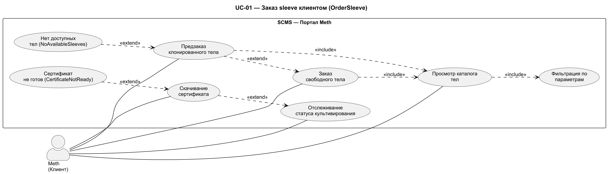
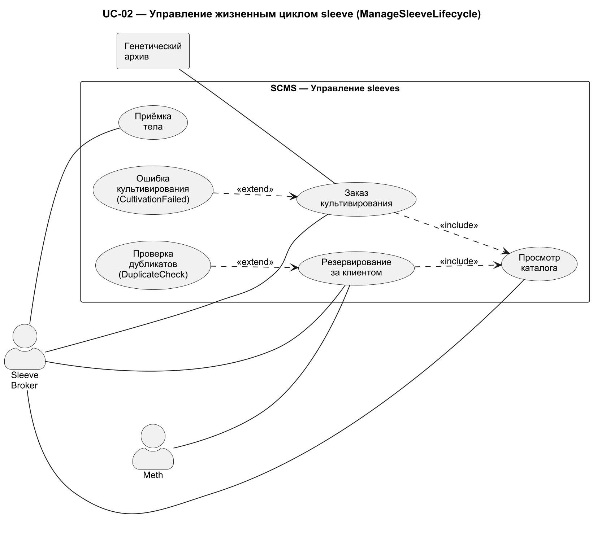
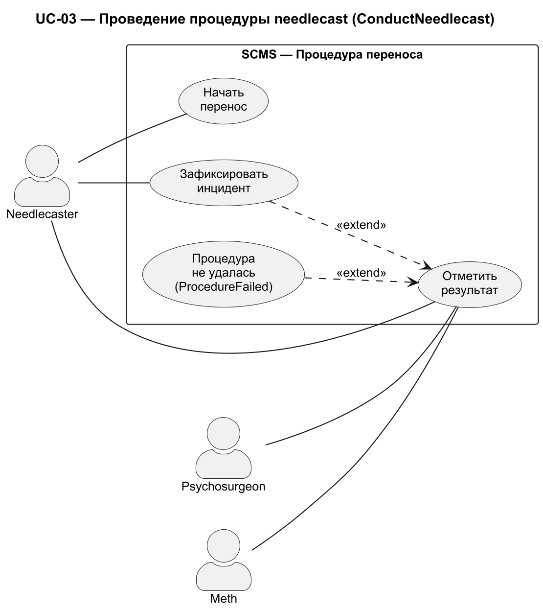
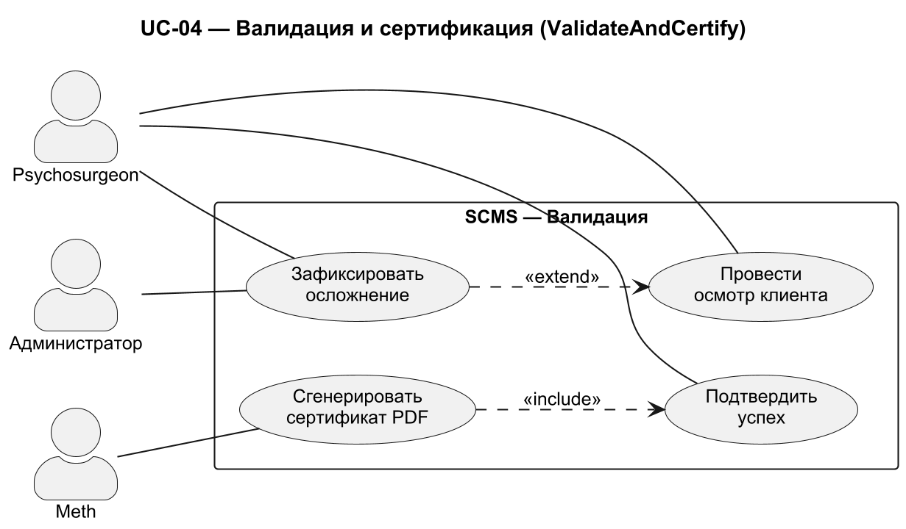
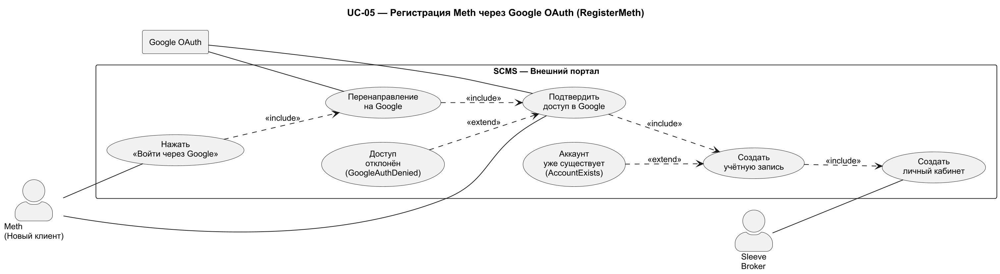

# Use Case Specification

## Описание прецедента

---

| Прецедент: OrderSleeve |
| :---- |
| ID: 1 |
| Краткое описание: Meth (клиент) просматривает каталог доступных тел, выбирает подходящее, оформляет заказ и скачивает сертификат совместимости после завершения процедуры. |
| Главные актеры: Meth (Клиент) |
| Второстепенные актеры: Sleeve Broker (подтверждает заказ) |
| Предусловия: Meth зарегистрирован в системе. Meth прошёл аутентификацию. |
| Основной поток: Прецедент начинается, когда Meth открывает личный кабинет. 1. Система отображает каталог доступных тел с параметрами (рост, вес, пол, возраст). 2. Meth применяет фильтры для поиска подходящего тела. 3. Система фильтрует каталог и отображает результаты. 4. Meth выбирает тело и нажимает «Заказать». 5. Система резервирует тело и создаёт кейс. 6. Meth отслеживает статус заказа в личном кабинете. 7. После завершения процедуры система генерирует PDF-сертификат. 8. Meth скачивает сертификат. Прецедент завершается. |
| Постусловия: Тело зарезервировано. Сертификат сохранён на устройстве Meth. |
| Альтернативные потоки: NoAvailableSleeves, CertificateNotReady |

| Альтернативный поток: OrderSleeve:NoAvailableSleeves |
| :---- |
| ID: 1.1 |
| Краткое описание: Свободных тел нет в каталоге. |
| Главные актеры: Meth (Клиент) |
| Второстепенные акторы: Sleeve Broker |
| Предусловия: Каталог пуст или нет тел, соответствующих фильтрам Meth. |
| Альтернативные потоки: Альтернативный поток начинается после шага 4 основного потока. 1. Meth нажимает «Предзаказать». 2. Система открывает форму предзаказа с параметрами (рост, вес, пол, возраст). 3. Meth заполняет параметры и подтверждает. 4. Система создаёт заказ на культивирование. 5. Система уведомляет Sleeve Broker. |
| Постусловия: Предзаказ создан. |

| Альтернативный поток: OrderSleeve:CertificateNotReady |
| :---- |
| ID: 1.2 |
| Краткое описание: Сертификат ещё не сгенерирован. |
| Главные актеры: Meth (Клиент) |
| Второстепенные акторы: Нет. |
| Предусловия: Процедура не завершена. |
| Альтернативные потоки: Альтернативный поток начинается после шага 6 основного потока. 1. Meth открывает раздел «Документы». 2. Система отображает статус: «Сертификат будет доступен после завершения процедуры». 3. Кнопка скачивания неактивна. |
| Постусловия: Сертификат недоступен. |

<!-- FR: FR-013-01, FR-013-02 -->

*Личный кабинет Meth: каталог тел с фильтрами, статус заказа, кнопка скачивания сертификата.*

---

| Прецедент: ManageSleeveLifecycle |
| :---- |
| ID: 2 |
| Краткое описание: Sleeve Broker управляет жизненным циклом тела: заказ культивирования в генетическом архиве, приёмка поступившего тела, резервирование за клиентом. |
| Главные актеры: Sleeve Broker |
| Второстепенные акторы: Meth (заказчик) |
| Предусловия: Sleeve Broker авторизован в системе. |
| Основной поток: Прецедент начинается, когда Sleeve Broker открывает каталог sleeves. 1. Система отображает список тел со статусами. 2. Broker нажимает «Заказать культивирование». 3. Система открывает форму заказа: выбор генетического архива, параметры тела. 4. Broker заполняет параметры и подтверждает заказ. 5. Система отправляет запрос в API генетического архива. 6. Система создаёт запись со статусом «В культивации». 7. По поступлении тела Broker открывает раздел «Приёмка». 8. Broker проверяет параметры и нажимает «Принять» или «Отклонить». 9. Если «Принять»: система переводит тело в статус «Доступно». 10. Broker нажимает «Зарезервировать» для привязки тела к Meth. 11. Система блокирует тело за клиентом. Прецедент завершается. |
| Постусловия: Тело заказано, принято и зарезервировано. Статус обновлён. |
| Альтернативные потоки: CultivationFailed, DuplicateCheck |

| Альтернативный поток: ManageSleeveLifecycle:CultivationFailed |
| :---- |
| ID: 2.1 |
| Краткое описание: Ошибка культивирования от генетического архива. |
| Главные актеры: Sleeve Broker |
| Второстепенные акторы: Meth |
| Предусловия: Заказ на культивирование создан. |
| Альтернативные потоки: Альтернативный поток начинается после шага 5 основного потока. 1. Система получает уведомление об ошибке от API. 2. Система переводит тело в статус «Ошибка культивации». 3. Система уведомляет Broker и Meth. |
| Постусловия: Заказ отменён. |

| Альтернативный поток: ManageSleeveLifecycle:DuplicateCheck |
| :---- |
| ID: 2.2 |
| Краткое описание: Попытка добавить дубликат тела. |
| Главные актеры: Sleeve Broker |
| Второстепенные акторы: Нет. |
| Предусловия: Тело с такими параметрами уже существует. |
| Альтернативные потоки: Альтернативный поток начинается после шага 4 основного потока. 1. Система проверяет дубликаты. 2. Система отображает ошибку. 3. Broker корректирует параметры. |
| Постусловия: Тело не добавлено. |

<!-- FR: FR-001-01, FR-001-02, FR-001-03, FR-002-01, FR-002-02, FR-003-01 -->

*Каталог sleeves со статусами. Форма заказа культивирования. Форма приёмки тела.*

---

| Прецедент: ConductNeedlecast |
| :---- |
| ID: 3 |
| Краткое описание: Needlecaster проводит процедуру переноса сознания: открывает кейс клиента, фиксирует начало переноса, отмечает результат. Система сохраняет протокол и уведомляет Psychosurgeon. |
| Главные актеры: Needlecaster |
| Второстепенные акторы: Psychosurgeon (уведомляется о завершении), Meth (статус обновляется) |
| Предусловия: Needlecaster авторизован в системе. Клиент Meth имеет зарезервированное тело. Стек клиента доступен. |
| Основной поток: Прецедент начинается, когда Needlecaster открывает список назначенных процедур. 1. Система отображает список кейсов на сегодня. 2. Needlecaster выбирает кейс. 3. Система открывает страницу процедуры: клиент, стек, тело. 4. Needlecaster нажимает «Начать перенос». 5. Система фиксирует время начала и меняет статус на «Перенос в процессе». 6. Needlecaster выполняет процедуру. 7. По завершении Needlecaster нажимает «Отметить результат» и выбирает «Успешно». 8. Система фиксирует время завершения и сохраняет протокол. 9. Система уведомляет Psychosurgeon. Прецедент завершается. |
| Постусловия: Протокол сохранён. Psychosurgeon уведомлён. Статус кейса: «Перенос завершён». |
| Альтернативные потоки: ProcedureFailed |

| Альтернативный поток: ConductNeedlecast:ProcedureFailed |
| :---- |
| ID: 3.1 |
| Краткое описание: Перенос не удался. |
| Главные актеры: Needlecaster |
| Второстепенные акторы: Psychosurgeon, Администратор |
| Предусловия: Процедура в процессе. |
| Альтернативные потоки: Альтернативный поток начинается после шага 6 основного потока. 1. Needlecaster нажимает «Зафиксировать инцидент». 2. Система запрашивает тип: stack shock / отторжение / повреждение стека. 3. Needlecaster выбирает тип и указывает описание. 4. Система сохраняет инцидент и меняет статус на «Инцидент». 5. Система уведомляет Psychosurgeon и администратора. |
| Постусловия: Инцидент зафиксирован. Кейс заблокирован. |

<!-- FR: FR-007-01, FR-008-01, FR-008-02 -->

*Страница процедуры: данные клиента, кнопки «Начать перенос», «Отметить результат», «Зафиксировать инцидент».*

---

| Прецедент: ValidateAndCertify |
| :---- |
| ID: 4 |
| Краткое описание: Psychosurgeon осматривает клиента после переноса, подтверждает успех или фиксирует осложнение. При успехе система генерирует PDF-сертификат. |
| Главные актеры: Psychosurgeon |
| Второстепенные акторы: Meth (получает сертификат) |
| Предусловия: Psychosurgeon авторизован в системе. Процедура needlecast завершена. |
| Основной поток: Прецедент начинается, когда Psychosurgeon открывает список кейсов на валидации. 1. Система отображает список кейсов, ожидающих валидации. 2. Psychosurgeon выбирает кейс. 3. Система открывает страницу: данные клиента, протокол переноса. 4. Psychosurgeon проводит осмотр (контрольные вопросы, тесты). 5. Psychosurgeon нажимает «Подтвердить». 6. Система генерирует PDF-сертификат с QR-кодом. 7. Система делает сертификат доступным Meth. 8. Система меняет статус кейса на «Завершено». Прецедент завершается. |
| Постусловия: Сертификат сгенерирован и доступен Meth. Кейс в статусе «Завершено». |
| Альтернативные потоки: Complications |

| Альтернативный поток: ValidateAndCertify:Complications |
| :---- |
| ID: 4.1 |
| Краткое описание: Обнаружены осложнения после переноса. |
| Главные актеры: Psychosurgeon |
| Второстепенные акторы: Meth, Администратор |
| Предусловия: Psychosurgeon выявил отклонения при осмотре. |
| Альтернативные потоки: Альтернативный поток начинается после шага 4 основного потока. 1. Psychosurgeon нажимает «Зафиксировать осложнение». 2. Система запрашивает тип: stack shock / фрагментация личности / отторжение. 3. Psychosurgeon выбирает тип и указывает описание. 4. Система сохраняет диагноз и создаёт инцидент. 5. Система блокирует выпуск клиента. 6. Система меняет статус на «Корректирующие процедуры». |
| Постусловия: Диагноз зафиксирован. Инцидент создан. Выпуск заблокирован. |

<!-- FR: FR-009-01, FR-010-01, FR-010-02, FR-011-01, FR-011-02 -->

*Страница валидации: данные клиента, протокол переноса, кнопки «Подтвердить» и «Зафиксировать осложнение».*

---

| Прецедент: RegisterMeth |
| :---- |
| ID: 5 |
| Краткое описание: Новый клиент (Meth) регистрируется на внешнем портале через Google OAuth: система перенаправляет на страницу Google, клиент подтверждает доступ, система создаёт учётную запись на основе данных Google-аккаунта. |
| Главные актеры: Meth (Новый клиент) |
| Второстепенные акторы: Sleeve Broker (уведомляется о новом клиенте) |
| Предусловия: Meth не зарегистрирован в системе. Meth имеет Google-аккаунт. |
| Основной поток: Прецедент начинается, когда Meth открывает публичную страницу клиники. 1. Meth нажимает «Войти через Google». 2. Система перенаправляет на страницу авторизации Google. 3. Meth выбирает Google-аккаунт и подтверждает доступ. 4. Google перенаправляет обратно в систему с токеном авторизации. 5. Система получает данные из Google (имя, email, аватар). 6. Система создаёт учётную запись Meth. 7. Система создаёт личный кабинет. 8. Meth получает доступ к личному кабинету с каталогом тел. Прецедент завершается. |
| Постусловия: Учётная запись создана через Google OAuth. Meth имеет доступ к личному кабинету. |
| Альтернативные потоки: GoogleAuthDenied, AccountExists |

| Альтернативный поток: RegisterMeth:GoogleAuthDenied |
| :---- |
| ID: 5.1 |
| Краткое описание: Meth отклонил доступ в Google. |
| Главные актеры: Meth (Новый клиент) |
| Второстепенные акторы: Нет. |
| Предусловия: Meth на странице авторизации Google. |
| Альтернативные потоки: Альтернативный поток начинается после шага 3 основного потока. 1. Meth нажимает «Отменить» или закрывает страницу Google. 2. Google перенаправляет обратно в систему с ошибкой. 3. Система отображает сообщение: «Авторизация отменена. Попробуйте снова.» 4. Регистрация прерывается. |
| Постусловия: Учётная запись не создана. |

| Альтернативный поток: RegisterMeth:AccountExists |
| :---- |
| ID: 5.2 |
| Краткое описание: Google-аккаунт уже привязан к существующей учётной записи. |
| Главные актеры: Meth (Новый клиент) |
| Второстепенные акторы: Нет. |
| Предусловия: Email из Google уже зарегистрирован в системе. |
| Альтернативные потоки: Альтернативный поток начинается после шага 5 основного потока. 1. Система проверяет уникальность email из Google. 2. Система находит существующую учётную запись. 3. Система перенаправляет Meth на вход в личный кабинет. |
| Постусловия: Новая учётная запись не создана. Meth входит в существующий кабинет. |

<!-- FR: FR-014-01, FR-014-02 -->

*Публичная страница клиники с кнопкой «Войти через Google».*
